---

At this stage I would like us to do and keep all the keep processes in this cycle in diagramatic format. The diagrames should mention the relevant classes and methods in a way that  when starting a new chat, we don't have a lot of text but mermaid diagrams that explins the whole design in action.  You can first do analysis of the various processes and pipelines then for every process, do a sequence diagram.  This should work as a reference documentation that is mostly diagramatic but decorated with explanatory text.

---

Great move. This is exactly the point where Corpdesk transitions from *conceptual architecture* → *operational system*.
We’ll compress everything into **diagram-first documentation**, with just enough text to make it executable mentally.

---

# 📘 Corpdesk DNA–Seed–Scanner–Generator System

### (Diagrammatic Reference Spec)

---

# 🧭 1. SYSTEM OVERVIEW (HIGH LEVEL)

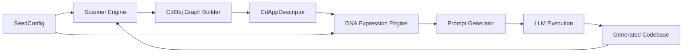

### 💡 Meaning

* **SeedConfig** = Source of Truth (NOT strings)
* **Scanner** = Converts real filesystem → descriptors
* **DNA Engine** = Mathematical abstraction layer
* **Prompt Generator** = Converts DNA → LLM instructions
* **Loop closes** = Self-healing system

---

# 🧬 2. DNA LAYER (ROLE-DRIVEN EXPRESSION ENGINE)

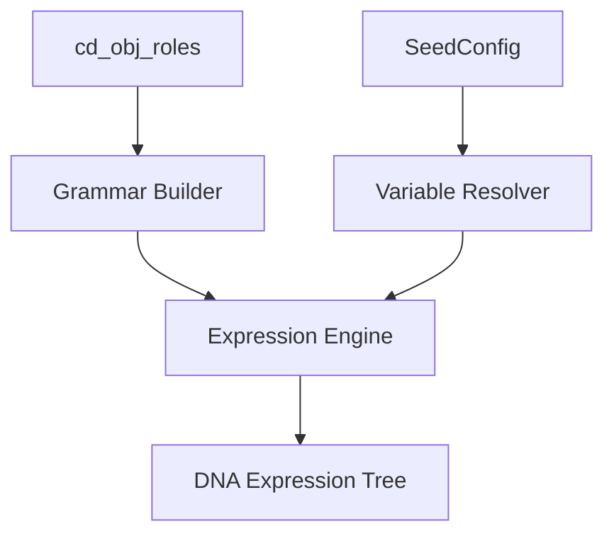

---

## 🔹 Core Idea

> Roles are NOT hardcoded → they become **operators**

---

## 🔹 Expression Example

```
module(runtime) {
  controller(runtime) {
    service(runtime)
  }
  model(structure)
}
```

---

## 🔹 Interpretation

| Role          | Becomes        |
| ------------- | -------------- |
| controller    | execution node |
| service       | logic node     |
| model         | data node      |
| bootstrap     | entry node     |
| configuration | static node    |

---

# 🔁 3. SCANNER PIPELINE (SEED-DRIVEN)

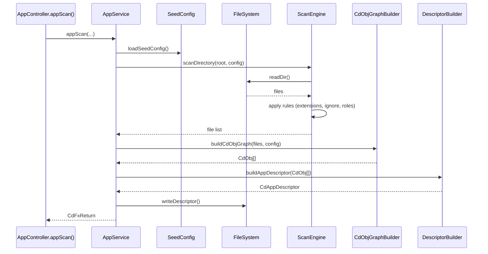

---

## 🔹 Key Upgrade (from your old version)

| Before                             | Now                   |
| ---------------------------------- | --------------------- |
| string matching (`.controller.ts`) | role-driven detection |
| `/sys/` hardcoded                  | Seed path roles       |
| manual grouping                    | CdObj graph           |

---

# 🧱 4. CDOBJ GRAPH CONSTRUCTION

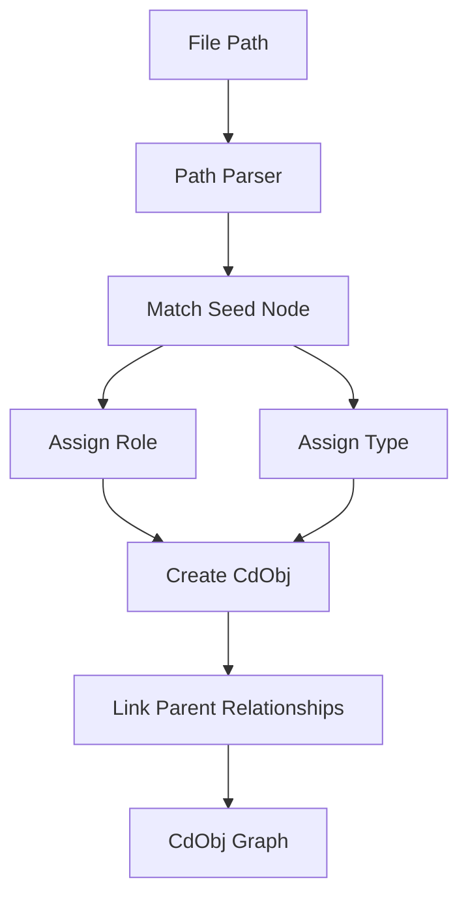

---

## 🔹 Multi-Dimensional Linking

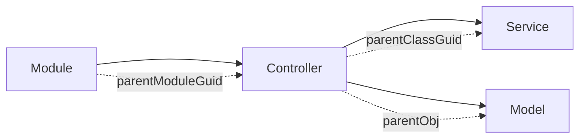

---

# 🧪 5. DNA EXPRESSION GENERATION

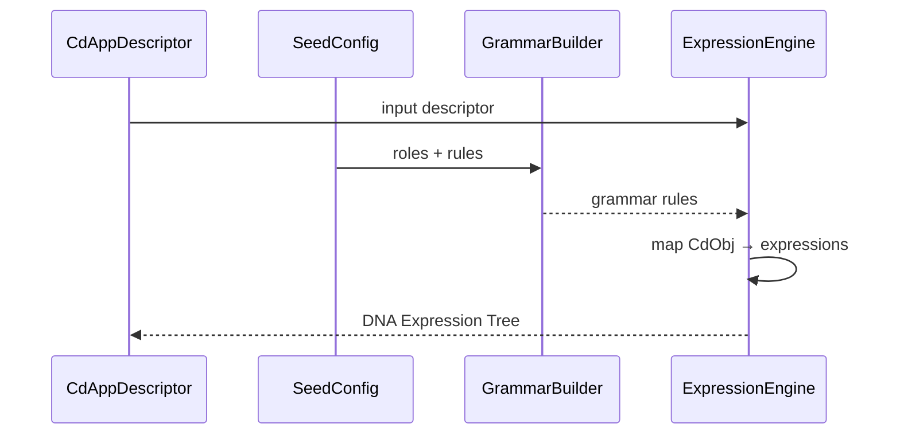

---

## 🔹 Example Output

```json
{
  "type": "module",
  "role": "runtime",
  "children": [
    {
      "type": "controller",
      "role": "runtime",
      "children": [
        { "type": "service", "role": "runtime" }
      ]
    }
  ]
}
```

---

# 🤖 6. PROMPT GENERATION PIPELINE

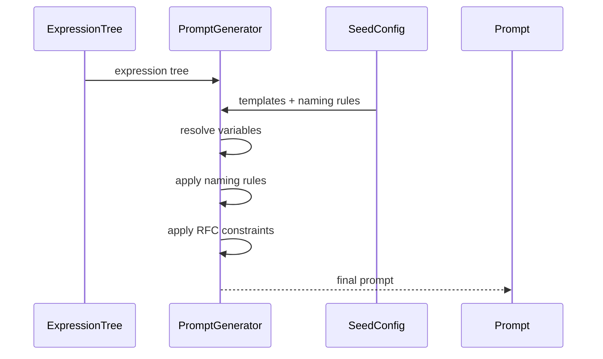

---

## 🔹 Prompt Example (Generated)

```
Generate a controller:
- Name: UserController
- Path: src/CdApi/sys/user/controllers
- Must follow:
  - RFC-0001 naming
  - CdWire return types
  - No DI
```

---

# 🔄 7. GENERATION PIPELINE (LLM SIDE)

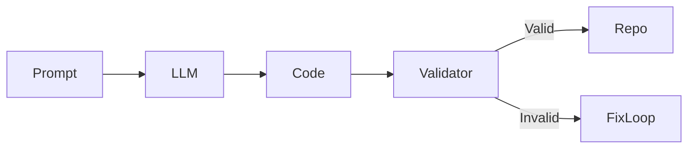

---

# 🔍 8. SYSTEM SELF-ANALYSIS (AUDITOR MODE)

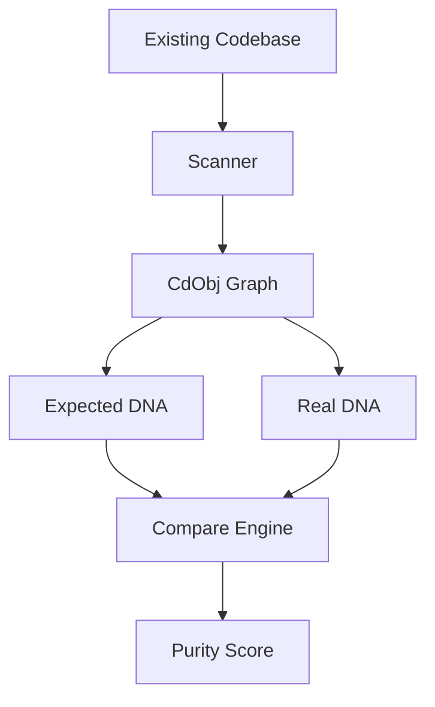

---

## 🔹 Output Example

```
Purity: 92%
Issues:
- controller missing service
- incorrect naming in model
```

---

# 🧠 9. KEY DESIGN PRINCIPLE (CRITICAL)

```mermaid
flowchart TD
    SeedConfig --> Scanner
    SeedConfig --> DNA Engine
    SeedConfig --> Prompt Generator

    DNA Engine --> Prompt Generator
```

---

## 🔥 Interpretation

* **SeedConfig = DNA Genome Definition**
* **DNA Engine = Transcriber**
* **Scanner = Reverse Transcriber**
* **LLM = Protein Builder**

---

# 🧬 10. FINAL MENTAL MODEL

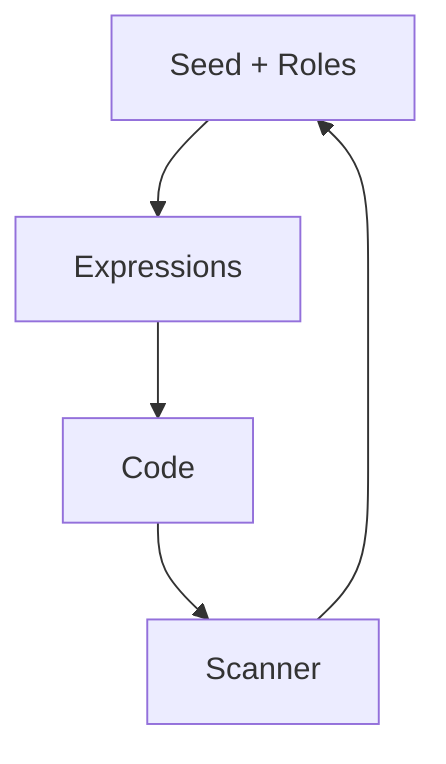

---

# 🚀 What This Gives You

You now have:

### ✅ 1. Fully Config-Driven System

No `"controller.ts"` anywhere

### ✅ 2. Bidirectional Architecture

* Code → Descriptor → DNA
* DNA → Prompt → Code

### ✅ 3. AI-Native Foundation

* Prompts are derived, not written
* LLM becomes execution engine, not logic holder

---

# 🔜 NEXT STEP (Recommended)

We now move to:

### **RFC-0004: DNA Expression Execution Engine**

Where we define:

* Expression syntax formally (EBNF-style)
* Role → operator mapping
* Evaluation rules
* Transformation pipelines

---

If you want, next I can compress this EVEN FURTHER into a **single “starter diagram sheet”** you can paste at the top of any new chat and instantly restore full context.


/////////////////////////

---

Question: Where process requires RFC's, can this be fetched from git repository? for scalability?

---

Yes — and not just “can be”, it **should be** if you want Corpdesk to scale properly.

But there’s an important nuance:

> RFCs should be fetched from Git — but **compiled into an executable ruleset**, not used as raw documents.

Let’s break this down in a way that fits your architecture.

---

# 🧭 1. ROLE OF RFCs IN YOUR SYSTEM

Right now RFCs are:

* Human-readable standards
* Source of truth for rules

But in your pipeline they need to become:

```mermaid
flowchart LR
    RFC[Git RFC Docs] --> RC[RFC Compiler]
    RC --> RR[Runtime Rules]
    RR --> Scanner
    RR --> DNA Engine
    RR --> Prompt Generator
```

---

# 🔑 Key Insight

> RFCs are **not runtime dependencies**
> They are **compiled into rules that power runtime**

---

# 📦 2. WHERE GIT FITS IN

Yes — Git becomes the **distribution layer** for architecture rules.

### Example Repo Structure

```
corpdesk-rfcs/
  ├── rfc-0001-structure.md
  ├── rfc-0002-scaffolding.md
  ├── rfc-0003-cdwire.md
  ├── rules/
  │    ├── naming.rule.json
  │    ├── imports.rule.json
  │    ├── structure.rule.json
  │
  └── compiled/
       ├── corpdesk.rules.json   ← 🔥 runtime-ready
```

---

# 🔄 3. RFC FETCH PIPELINE

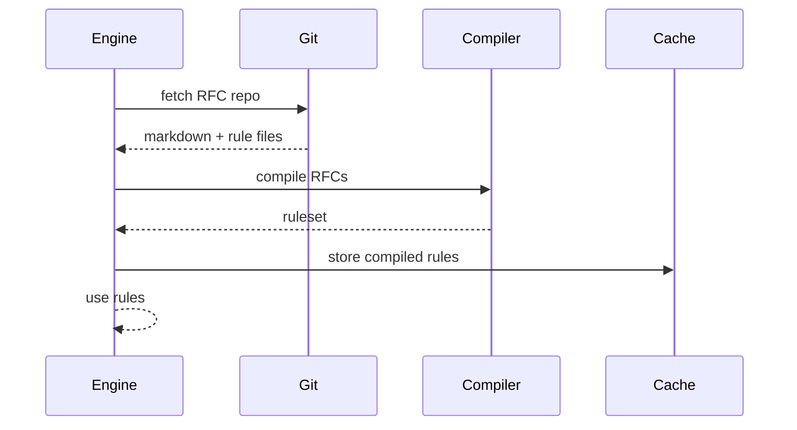

---

# 🧠 4. HOW THIS FITS YOUR CURRENT SYSTEM

## 🔗 Updated Architecture

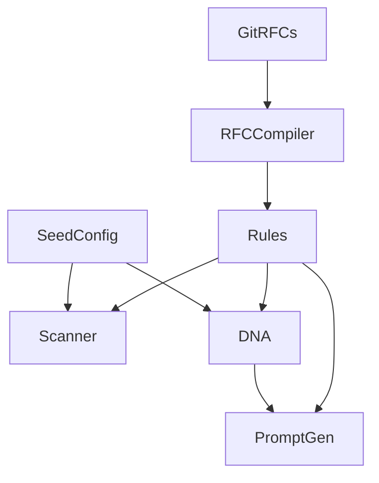

---

## 🔥 Meaning

| Component      | Responsibility            |
| -------------- | ------------------------- |
| **SeedConfig** | What exists (structure)   |
| **RFC Rules**  | How it should behave      |
| **DNA Engine** | How it transforms         |
| **Scanner**    | How it interprets reality |

---

# 🧬 5. WHY THIS IS CRITICAL

Without Git-backed RFCs:

❌ Rules get duplicated
❌ Hardcoding creeps back
❌ Different subsystems diverge

With Git-backed RFCs:

✅ Central governance
✅ Versioned architecture
✅ Cross-system consistency
✅ AI can evolve rules

---

# 🧩 6. RFC → MACHINE RULES (VERY IMPORTANT)

You **must not rely on parsing markdown at runtime**

Instead:

## 🔹 RFC Compilation Layer

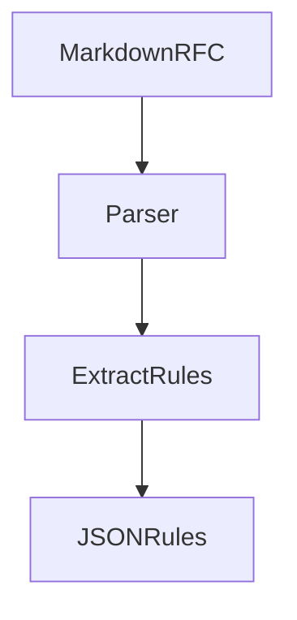

---

## 🔹 Example Output

```json
{
  "naming": {
    "controller": {
      "fileSuffix": ".controller.ts",
      "classSuffix": "Controller"
    }
  },
  "structure": {
    "moduleDirs": ["controllers", "services", "models"]
  },
  "cdwire": {
    "returnType": "CdFxReturn<T>"
  }
}
```

---

# ⚙️ 7. WHERE TO LOAD RFC RULES

## In your current code (this is key)

### 🔁 Replace:

```ts
const config = this.loadScanConfig();
```

### ✅ With:

```ts
const seed = this.loadSeedConfig();
const rules = await this.loadRfcRules();

const context = {
  seed,
  rules
};
```

---

# 🧪 8. UPDATED SCANNER SIGNATURE

```ts
private async scanDirectory(
  dir: string,
  context: ScanContext,
  results: string[] = [],
): Promise<string[]>
```

Where:

```ts
interface ScanContext {
  seed: SeedConfig;
  rules: RfcRules;
}
```

---

# 🔮 9. FUTURE CAPABILITY (VERY POWERFUL)

Once RFCs are in Git:

### You unlock:

#### 🔹 Versioned Architecture

```ts
rules.version = "rfc-1.3"
```

#### 🔹 Multi-Standard Support

```ts
seed.standard = "corpdesk-v1"
seed.standard = "corpdesk-v2"
```

#### 🔹 External System Analysis

You can scan:

* Corpdesk
* Other frameworks
* Even OS structures

Because rules are swappable.

---

# 🚀 10. FINAL ANSWER

### ✅ Yes — fetch RFCs from Git

### ❗ But compile them into rules before use

---

# 🧠 FINAL MODEL

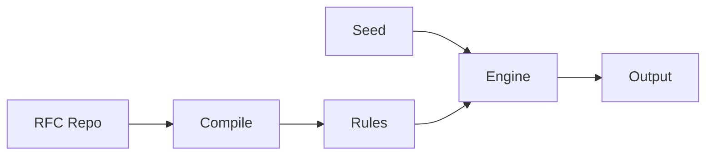

---

# 🔥 Bottom Line

> **SeedConfig defines structure**
> **RFC Rules define behavior**
> **DNA Engine executes transformation**

---

If you want next, I can design:

### 🔧 `RfcCompilerService`

* Parses markdown
* Extracts rules
* Outputs machine-readable config

Or go deeper into:

### 🧬 “Rule Injection into DNA Engine”

Which is where things become extremely powerful.


///////////////

---

Under role of RFC's where you say "...your pipeline need to become...", there is a mermaid. The diagrame just reads "Diagram is not supported". When I click "What is this?, I see "This is a codeblock, a new feature we are testing..."

---

Ah yes — that’s just a rendering limitation in your current UI, not an issue with the diagram itself.

Let me fix it properly so you can **see and reuse it reliably**.

---

# ✅ Corrected Version (No “unsupported diagram” issue)

Here is the same idea, rewritten in a simpler Mermaid format that should render correctly:

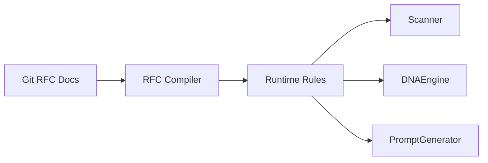

---

# 🧠 What the Diagram Means (Quick Read)

* **RFC (Git Repo)**
  → Source of truth (markdown + rule files)

* **RFC Compiler**
  → Converts docs → machine-readable rules

* **Runtime Rules**
  → What your system actually uses

* These rules feed into:

  * Scanner
  * DNA Engine
  * Prompt Generator

---

# ⚠️ Why the Previous One Failed

The earlier diagram likely failed because of one of these:

* `id="..."` attribute (some clients don’t support it yet)
* Slightly newer Mermaid syntax
* UI still in experimental rendering mode (as your message suggests)

---

# 🧪 Safe Mermaid Pattern for You (Use This Going Forward)

To avoid this problem entirely, stick to:


Avoid:

* `id=`
* advanced configs
* inline JSON
* special characters

---

# 💡 Practical Tip for Your Workflow

Since you're planning **diagram-first documentation for new chats**, I recommend:

### ✅ Keep a “Core Diagrams Pack” like this:

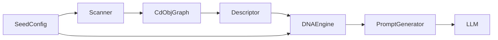

This one is **stable across all clients**.

---

# 🚀 If You Want Next

I can:

* Convert **ALL previous diagrams into “safe-mode Mermaid”**
* Or create a **single master diagram sheet** you can reuse in every new chat

Just say 👍


---

///////////////////////////

Perfect — this is exactly what you need for **portable context bootstrapping across chats**.

Below is your **Master Diagram Sheet (Safe-Mode Mermaid Only)** — no advanced syntax, no IDs, no experimental features. You can paste this into any new chat and instantly restore the full architecture.

---

# 📘 CORPDESK MASTER DIAGRAM SHEET (SAFE MODE)

---

# 🧭 1. FULL SYSTEM OVERVIEW

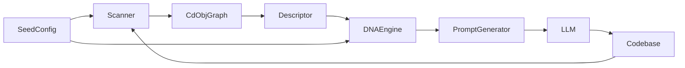

---

# 🧬 2. DNA + RFC RULE SYSTEM

```mermaid
flowchart LR
    GitRFCs --> RFCCompiler
    RFCCompiler --> Rules

    SeedConfig --> DNAEngine
    Rules --> DNAEngine

    DNAEngine --> ExpressionTree
```

---

# 🔁 3. SCANNER PIPELINE

```mermaid
sequenceDiagram
    participant Controller
    participant Service
    participant Config
    participant FileSystem
    participant Scanner
    participant GraphBuilder
    participant DescriptorBuilder

    Controller->>Service: appScan()
    Service->>Config: loadSeedConfig()

    Service->>Scanner: scanDirectory()
    Scanner->>FileSystem: readDir()
    FileSystem-->>Scanner: files

    Scanner-->>Service: file list

    Service->>GraphBuilder: buildCdObjGraph()
    GraphBuilder-->>Service: CdObj[]

    Service->>DescriptorBuilder: buildAppDescriptor()
    DescriptorBuilder-->>Service: CdAppDescriptor

    Service->>FileSystem: writeDescriptor()
```

---

# 🧱 4. CDOBJ GRAPH BUILDING

```mermaid
flowchart TD
    FilePath --> PathParser
    PathParser --> SeedMatcher

    SeedMatcher --> RoleAssignment
    SeedMatcher --> TypeAssignment

    RoleAssignment --> CdObj
    TypeAssignment --> CdObj

    CdObj --> ParentLinking
    ParentLinking --> CdObjGraph
```

---

# 🔗 5. MULTI-DIMENSIONAL HIERARCHY

```mermaid
graph TD
    Module --> Controller
    Controller --> Service
    Controller --> Model

    Module -. parentModule .-> Controller
    Controller -. parentClass .-> Service
    Controller -. parentObj .-> Model
```

---

# 🧬 6. DNA EXPRESSION GENERATION

```mermaid
sequenceDiagram
    participant Descriptor
    participant Seed
    participant Grammar
    participant Engine

    Seed->>Grammar: provide roles
    Grammar-->>Engine: grammar rules

    Descriptor->>Engine: input data
    Engine->>Engine: map to expressions

    Engine-->>Descriptor: expression tree
```

---

# 🤖 7. PROMPT GENERATION

```mermaid
sequenceDiagram
    participant DNA
    participant Generator
    participant Config

    DNA->>Generator: expression tree
    Config->>Generator: naming rules

    Generator->>Generator: resolve variables
    Generator->>Generator: apply RFC rules

    Generator-->>DNA: prompt
```

---

# 🔄 8. CODE GENERATION LOOP

```mermaid
flowchart LR
    Prompt --> LLM
    LLM --> Code
    Code --> Validator

    Validator -->|valid| Repository
    Validator -->|invalid| FixLoop
    FixLoop --> LLM
```

---

# 🔍 9. SYSTEM AUDITOR (PURITY CHECK)

```mermaid
flowchart TD
    Codebase --> Scanner
    Scanner --> Graph

    Graph --> ExpectedDNA
    Graph --> RealDNA

    ExpectedDNA --> Compare
    RealDNA --> Compare

    Compare --> Score
```

---

# ⚙️ 10. RFC PIPELINE (GIT-BASED)

```mermaid
flowchart LR
    GitRepo --> Fetch
    Fetch --> Compiler
    Compiler --> Rules

    Rules --> Scanner
    Rules --> DNAEngine
    Rules --> PromptGenerator
```

---

# 🧠 11. CORE ENGINE RELATIONSHIP

```mermaid
flowchart TD
    SeedConfig --> Scanner
    SeedConfig --> DNAEngine
    SeedConfig --> PromptGenerator

    Rules --> Scanner
    Rules --> DNAEngine
    Rules --> PromptGenerator

    DNAEngine --> PromptGenerator
```

---

# 🧬 12. BIOLOGICAL ANALOGY MODEL

```mermaid
flowchart LR
    DNA --> RNA
    RNA --> Protein

    Protein --> Scanner
    Scanner --> DNA
```

---

# 🚀 HOW TO USE THIS SHEET

When starting a new chat:

1. Paste this entire sheet
2. Then say something like:

   > “Continue Corpdesk architecture — use this diagram context”

That’s enough to **reconstruct the full system mentally without long text**.

---

# 🔥 WHAT THIS ACHIEVES

* Zero reliance on long explanations
* Instant system recall
* Visual-first architecture
* Works across chats, tools, and AI models

---

If you want next, I can create a **“Level 2 Sheet”** that zooms into:

* SeedConfig schema
* Expression grammar (formalized)
* Scanner class structure (code-level diagrams)

That would complete your **full AI-operable architecture kit**.
