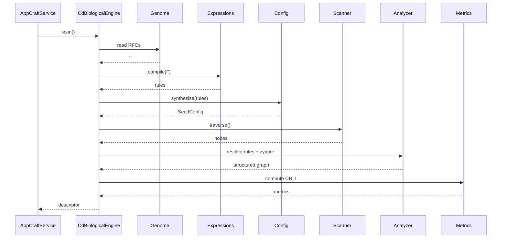

# 🧬 Corpdesk Continuation Context — Biological Engine Implementation Phase

## 1. Current State

We are building **Corpdesk**, a descriptor-driven, AI-compatible software architecture system.

At this stage, we have:

### ✅ Established Foundations

* **RFC-0001: Corpdesk Standard Development Architecture**

  * Defines structure, naming conventions, modules, and descriptors
  * Language-agnostic

* **RFC-0004: Mathematical Architecture & Autonomous Development Framework (v3)**

  * Defines:

    * Γ (Genome / Descriptor)
    * Σ (Roles / Dimensions)
    * Ω (Foreign / Extension set)
    * CR (Compliance Ratio)
    * I (Infection Ratio)
  * Establishes:

    ```
    RFCs → Mathematical Expressions → SeedConfig → Execution
    ```

* **RFC-0005: Zygote Capture & Execution Model**

  * Defines:

    * Zygote (Origin O)
    * Dependency Graph extraction
    * Boot sequence capture

* **Biological Engine RFC (new)**

  * Introduces lifecycle:

    ```
    Genome → Expression → Configuration → Execution → Mutation → Selection
    ```
  * Establishes biological analogy as **core system philosophy**

---

## 2. Key Architectural Principle (CRITICAL)

We have **strict separation of transformation stages**:

### Stage 1 — RFC → Mathematical Expressions

* Source of truth = RFCs
* Output = Formal expressions (rules, constraints, logic)
* Responsibility = **Expression Compiler**

---

### Stage 2 — Mathematical Expressions → SeedConfig

* Output = executable scanning/generation configuration
* Responsibility = **Configuration Synthesizer**

---

### Stage 3 — SeedConfig → Execution

* Output:

  * Descriptor (Γ)
  * Directory Tree
  * Graph
  * Metrics (CR, I, Ω)
* Responsibility = **Execution Engine (Scanner / Genesis)**

---

⚠️ These stages MUST remain **decoupled**

---

## 3. Current Implementation Reality

* Execution is currently handled in:

  ```
  CdAppService.scan()
  ```

* This includes:

  * Directory traversal
  * Role resolution
  * Descriptor generation
  * Partial metrics

⚠️ Problem:

* Responsibilities are **collapsed into one service**
* Biological lifecycle is **not explicitly modeled in code**

---

## 4. Target Refactor Direction

We now want to implement a **Biological Processing Engine** inside AppCraft.

This engine will **modularize the lifecycle into "organs"**

---

## 5. Biological Engine — Conceptual Model

### Core Engine

```ts
class CdBiologicalEngine
```

Acts as orchestrator of lifecycle.

---

### Internal Organs (STRICT RESPONSIBILITY BOUNDARIES)

#### 🧬 1. Genome Reader

```ts
class CdGenomeReader
```

* Reads RFC-derived definitions
* Produces Γ inputs

---

#### 🧪 2. Expression Compiler

```ts
class CdExpressionCompiler
```

* Converts RFC rules → executable expressions
* Produces formal logic layer

---

#### ⚙️ 3. Configuration Synthesizer

```ts
class CdSeedConfigSynthesizer
```

* Converts expressions → SeedConfig

---

#### 👁️ 4. Scanner (Sensory System)

```ts
class CdScanner
```

* Traverses filesystem
* Builds raw node set

---

#### 🧠 5. Role Resolver (Cognition)

```ts
class CdRoleResolver
```

* Assigns roles using:

  ```
  Role(node) = f(Expression, Context)
  ```

---

#### 🌱 6. Zygote Analyzer

```ts
class CdZygoteAnalyzer
```

* Identifies entry point (main.ts, cli entry)
* Extracts dependency graph

---

#### 🌳 7. Structure Builder

```ts
class CdStructureBuilder
```

* Builds Directory Tree
* Builds Graph (nodes + edges)

---

#### 🧫 8. Mutation Analyzer

```ts
class CdMutationAnalyzer
```

* Classifies:

  * IsCdCompliant
  * IsCdForeign
  * Ω_valid vs Ω_invalid

---

#### ⚖️ 9. Metrics Engine

```ts
class CdMetricsEngine
```

Computes:

```math
CR = compliance ratio
I = infection ratio
```

---

#### 💾 10. Descriptor Writer

```ts
class CdDescriptorWriter
```

* Outputs:

  * cd-app.descriptor.json

---

## 6. Execution Flow (Target)



---

## 7. Immediate Next Step (IMPORTANT)

👉 Implement the **Biological Engine classes (skeleton level first)**

### Requirements:

* Clear separation of concerns
* Strong logging:

  ```
  CdLog.x(`[Class][method] variable:, ${value}`)
  ```
* Interfaces where appropriate
* No business logic collapse

---

## 8. Constraints

* MUST align with RFC-0001 naming rules
* MUST preserve:

  * IsCdCompliant
  * IsCdForeign
* MUST support:

  * Zygote capture
  * Future multi-language support

---

## 9. Strategic Direction

This system is evolving toward:

> **AI-driven, self-improving software generation**

Where:

* Scanner = perception
* RFCs = genetic law
* AI = evolutionary force

---

## 10. Instruction for Next Chat

👉 Start by generating:

1. `CdBiologicalEngine` (orchestrator)
2. All organ class skeletons
3. Method signatures only (first pass)
4. Then progressively implement each organ

---

# 🧬 End of Context
