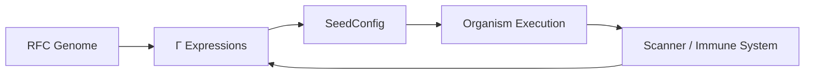
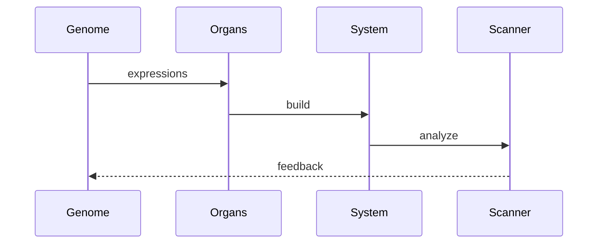

# 📄 RFC-0007: Corpdesk Biological Processing Engine (BPE)

**RFC ID:** corpdesk-rfc-0007
**Title:** Biological Processing Engine for Autonomous Software Generation
**Status:** Draft (Initial)
**Author:** Corpdesk Architecture
**Date:** 2026-04-02

---

# 1. Abstract

Throughout history, major technological breakthroughs have emerged from **anchoring design principles in natural systems**.

Examples include:

* **Aeronautics**, where early flight engineering drew directly from **bird and insect wing mechanics**, leading to modern aviation.
* **Swarm intelligence**, inspired by ants and bees, now used in optimization algorithms and distributed systems.
* **Biochemistry and medicine**, where understanding DNA, proteins, and cellular processes has enabled gene therapy, vaccines, and synthetic biology.

These advancements share a common principle:

> **Nature provides proven, self-optimizing, adaptive systems that can be abstracted into engineering models.**

---

## 1.1 Corpdesk Biological Analogy

Corpdesk adopts this same principle by modeling software systems as **living computational organisms**.

The goal is to move from:

```text
manually written software
```

to:

```text
AI-assisted, self-generating, self-evolving systems
```

This is achieved by aligning the software lifecycle with **biological generation cycles**:

| Biology            | Corpdesk                     |
| ------------------ | ---------------------------- |
| DNA                | RFCs                         |
| Gene Expression    | Mathematical Expressions (Γ) |
| Cellular Formation | SeedConfig                   |
| Organism           | Runtime System               |
| Observation        | Scanner                      |
| Evolution          | AI-assisted mutation         |

---

## 1.2 Intent

This RFC defines the **Biological Processing Engine (BPE)** — a structured computational system that:

* Converts **architectural laws (RFCs)** into executable systems
* Enables **zygote-based system initialization**
* Supports **continuous evolution via AI feedback loops**
* Maintains **strict architectural boundaries**

The BPE is embedded within **AppCraft** and operates as the **core engine for autonomous software generation**.

---

# 2. Scope

This RFC defines:

* The **biological architecture model**
* The **processing lifecycle**
* The **internal organ structure**
* The **relationship to existing RFCs (0001, 0004, 0005)**

This RFC does NOT define:

* Specific programming language implementations
* UI/CLI interfaces
* External subsystem behavior

---

# 3. Terminology

| Term              | Definition                                            |
| ----------------- | ----------------------------------------------------- |
| **Subsystem**     | Deployable Corpdesk system (cd-cli, cd-api, cd-shell) |
| **Organism**      | Runtime instance of a subsystem                       |
| **Zygote**        | Entry point initiating system execution               |
| **Genome (DNA)**  | RFC-defined architectural rules                       |
| **Γ (Gamma)**     | Mathematical expression model                         |
| **SeedConfig**    | Execution blueprint                                   |
| **Organ**         | Internal processing unit of BPE                       |
| **Immune System** | Scanner and validation engine                         |

---

# 4. Biological Processing Model

---

## 4.1 Canonical Lifecycle



---

## 4.2 Mathematical Representation

```math
System = f(Γ, SeedConfig)
```

Where:

* Γ = expression graph derived from RFCs
* SeedConfig = executable projection of Γ

---

## 4.3 Zygote Definition

```math
Z = (O, D)
```

Where:

* **O** = origin (entry point)
* **D** = dependency graph

---

# 5. Architectural Layers

---

## 5.1 Compilation Layers

```text
RFC → Expressions → SeedConfig → Execution
```

| Layer             | Responsibility               |
| ----------------- | ---------------------------- |
| RFC Compiler      | Converts rules → expressions |
| Expression Engine | Evaluates structural logic   |
| Seed Compiler     | Produces execution config    |
| Execution Engine  | Builds and analyzes system   |

---

## 5.2 Boundary Rule (MANDATORY)

Each layer:

* MUST only depend on adjacent layers
* MUST NOT bypass intermediate transformations

---

# 6. Biological Engine (BPE)

---

## 6.1 Definition

The **Biological Processing Engine (BPE)** is the internal system within AppCraft responsible for:

* system generation
* system analysis
* system evolution

---

## 6.2 Placement

```text
AppCraft
   └── Biological Processing Engine (BPE)
         └── Organs
```

---

# 7. Organs (Internal Processing Units)

---

## 7.1 Definition

Organs are **modular processing units** responsible for specific stages of the lifecycle.

---

## 7.2 Core Organs

### 🧬 Genome Transcriber

```ts
CdGenomeTranscriber
```

* Converts RFCs → Γ expressions

---

### 🧬 Genetic Expression Engine

```ts
CdGeneticExpressionEngine
```

* Evaluates expressions against context

---

### 🧬 Cellular Translator

```ts
CdCellularTranslator
```

* Converts Γ → SeedConfig

---

### 🧬 Organism Builder

```ts
CdOrganismBuilder
```

* Builds directory and runtime structure

---

### 🧬 Zygote Analyzer

```ts
CdZygoteAnalyzer
```

* Detects entry point
* Extracts dependency graph

---

### 🧬 Immune System

```ts
CdImmuneSystem
```

* Computes CR (Compliance Ratio)
* Detects Ω (foreign nodes)

---

# 8. Lifecycle Controller

---

## 8.1 Base Class

```ts
abstract class CdOrganismLifecycle {
  abstract transcribeGenome(): Promise<CdExpressionGraph>;
  abstract translateGenome(genome: CdExpressionGraph): Promise<SeedConfig>;
  abstract instantiateOrganism(config: SeedConfig): Promise<DirectoryNode>;
  abstract observeOrganism(root: DirectoryNode): Promise<ScanMetrics>;
}
```

---

## 8.2 Zygote Specialization

```ts
class CdZygoteLifecycle extends CdOrganismLifecycle {}
```

---

## 8.3 Service Integration

```ts
class CdAppService extends CdZygoteLifecycle {}
```

---

# 9. Zygote-Centric Execution

---

## 9.1 Importance

The Zygote represents:

* system origin
* boot logic
* minimal viable life

---

## 9.2 Execution Expansion

```math
System_0 = expand(Z)
```

---

# 10. Immune System & Metrics

---

## 10.1 Compliance Ratio

```math
CR = compliant / total
```

---

## 10.2 Infection Ratio

```math
I = Ω / total
```

---

## 10.3 Omega Classification

```math
Ω = Ω_valid ∪ Ω_invalid
```

---

# 11. Evolution Cycle

---

## 11.1 Loop



---

## 11.2 AI Role

AI agents:

* analyze Γ and Ω
* propose mutations
* improve CR over iterations

---

# 12. Language Independence

---

## 12.1 Principle

RFCs and Γ are:

```text
language-agnostic
```

---

## 12.2 Implication

Same genome can generate:

* TypeScript system
* Python system
* Go system

---

## 12.3 Translation Responsibility

Handled by:

```ts
CdCellularTranslator
```

---

# 13. Integration with Existing RFCs

---

| RFC      | Role               |
| -------- | ------------------ |
| RFC-0001 | Naming & structure |
| RFC-0003 | Execution protocol |
| RFC-0004 | Mathematical model |
| RFC-0005 | Zygote capture     |

---

# 14. Design Principles

---

## 14.1 Core Principles

* Biology as architecture
* Separation of concerns
* Deterministic transformation
* AI-native design

---

## 14.2 Boundary Integrity

```text
RFC ≠ Execution
Expressions ≠ Runtime
```

---

# 15. Future Scope

---

* Self-healing systems
* Adaptive mutation engines
* Multi-language generation pipelines
* Evolutionary fitness optimization

---

# 16. Conclusion

The Biological Processing Engine transforms software development into:

> **a controlled, observable, and evolvable biological process**

Corpdesk systems are no longer written — they are:

```text
generated → observed → evolved
```

This establishes a foundation for:

* autonomous development
* scalable architecture
* AI-driven system evolution

---

# 🏁 Final Statement

Corpdesk introduces a paradigm where:

> **software behaves as a living system governed by formal laws, expressed through computation, and refined through evolution**

---
