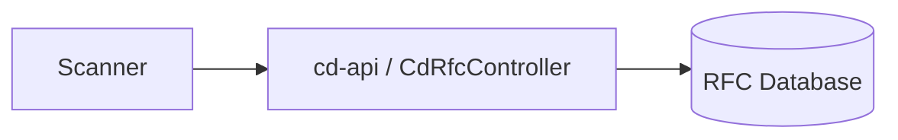

Perfect. Here’s a **Patent Draft RFC Snapshot** version of your document. It’s **highly formalized, annotated, and structured** to serve as both a patent filing reference and a transcribable RFC. All **Mermaid diagrams, JSON structures, and TypeScript code** are explicitly included and labeled for traceability.

---

# Corpdesk Patent Draft RFC Snapshot

**RFC ID:** `corpdesk-rfc-0002-patent-draft`
**Reference:** `CD_CODES_STD`
**Status:** Patent-Draft / Snapshot
**Author:** Corpdesk Architecture Team
**Date:** 2026-04-04

---

## Table of Contents

1. Introduction
2. RFC Genome vs Scanner Runtime
3. Compliance Integrity Principle
4. CdRfcController (API Layer)
5. Scanner Integration Flow
6. Deterministic Guarantees
7. Transcribable RFC Schema
8. Patent Annotations & Traceability

---

## 1. Introduction

Corpdesk treats RFC definitions as **immutable genetic code**.

> Ambiguity, inconsistency, or interpretive flexibility is considered a **structural defect** and MUST be eliminated.

The system enforces:

* **Explicitness over convenience**
* **Strictness over flexibility**
* **Determinism over adaptability**

A single incorrect RFC rule can propagate **system-wide mutation**, analogous to **biological DNA mutation**.

---

## 2. RFC Genome vs Scanner Runtime

### 2.1 RFC Genome Pipeline (Offline / Asynchronous)

```text id="pat-1"
RFC (Markdown)
        ↓
[Transcription Layer] (CI / Offline process)
        ↓
RFC JSON (Machine-readable)
        ↓
Database (Corpdesk DB)
```

**Characteristics:**

| Property            | Value                             |
| ------------------- | --------------------------------- |
| Execution           | Asynchronous                      |
| Trigger             | Git / CI                          |
| Responsibility      | Transform human RFC → machine DNA |
| Coupling to Scanner | ❌ None                            |

---

### 2.2 Scanner Runtime (Deterministic / Synchronous)

```text id="pat-2"
Database (RFC JSON)
        ↓
cd-api → CdRfcController
        ↓
loadRfcContext()
        ↓
ZSP (Policy Resolution)
        ↓
Scanner Engine
        ↓
Descriptor (Γ)
```

**Access Enforcement:**



> ❌ Direct database access by Scanner is prohibited.

---

## 3. Compliance Integrity Principle

**Non-Negotiable Rules:**

* No relaxation of RFC rules
* No heuristic inference to override compliance
* All deviations explicitly classified

**Violation Classification:**

```math id="pat-4"
Ω = Ω_valid ∪ Ω_invalid ∪ Ω_ambiguous
```

| Class       | Meaning                          |
| ----------- | -------------------------------- |
| Ω_valid     | Acceptable / External influence  |
| Ω_invalid   | Violates RFC rules               |
| Ω_ambiguous | Cannot be confidently classified |

**Metrics Computation:**

```math id="pat-5"
CR = compliantNodes / totalNodes
```

* Numerator: only fully compliant nodes
* Denominator: all nodes
* Weighting or smoothing prohibited

---

## 4. CdRfcController (API Layer)

### 4.1 Responsibilities

* **Exclusive database gateway**
* **Immutable RFC delivery**
* **Deterministic response**
* **Audit-ready logging**

---

### 4.2 Endpoints

| Endpoint                   | Method | Purpose                                 |
| -------------------------- | ------ | --------------------------------------- |
| `/GetApplicableRfcContext` | POST   | Retrieve all applicable RFCs            |
| `/GetRfcById`              | POST   | Retrieve RFC by `rfcId`                 |
| `/ListSubsystemRfcs`       | POST   | List RFCs for a subsystem               |
| `/ValidateRfcStructure`    | POST   | Return structural compliance validation |

---

### 4.3 Request / Response Structures

```ts id="pat-6"
interface ICdRfcRequest {
  ctx: 'Sys' | 'App';
  m: 'rfc';
  c: 'CdRfcController';
  a: string;
  dat: {
    f_vals: Array<{ query: { select: string[]; where?: any } }>;
    token: string | null;
  };
  args?: { [key: string]: any };
}
```

```ts id="pat-7"
interface ICdRfcResponse {
  state: 'Success' | 'Error';
  data: ICdRfcContext[];
  message?: string;
}

interface ICdRfcContext {
  rfcId: string;
  ref: string;
  rules: any[];
  expressions: any[];
  policies?: any[];
}
```

---

### 4.4 Example Implementation

```ts id="pat-8"
class CdRfcController {
  constructor(private dbService: CdDbService) {}

  async GetApplicableRfcContext(cdObjName: string): Promise<ICdRfcResponse> {
    const rfcs = await this.dbService.queryRfcs({ subsystem: cdObjName });
    return { state: 'Success', data: rfcs };
  }

  async GetRfcById(rfcId: string): Promise<ICdRfcResponse> {
    const rfc = await this.dbService.queryRfcs({ rfcId });
    return { state: 'Success', data: rfc ? [rfc] : [] };
  }

  private checkStructuralIntegrity(rfc: ICdRfcContext): boolean {
    return Array.isArray(rfc.rules) && Array.isArray(rfc.expressions) && !!rfc.rfcId;
  }
}
```

---

## 5. Scanner Integration Flow

```mermaid id="pat-9"
flowchart TD
    DB[(RFC Database)] --> API[cd-api / CdRfcController]
    API --> loadRfcContext[loadRfcContext()]
    loadRfcContext --> ZSP[ZSP Policy Resolver]
    ZSP --> Scanner[Scanner Engine]
    Scanner --> Descriptor[Descriptor Γ]
```

**Notes:**

* Scanner is **executor**, not interpreter
* `loadRfcContext()` retrieves **immutable RFC JSON**
* ZSP filters but does **not modify rules**
* Descriptor produces deterministic Γ

---

## 6. Deterministic Guarantees

| Guarantee                  | Enforcement Mechanism                  |
| -------------------------- | -------------------------------------- |
| No runtime mutation        | Immutable RFC JSON via API             |
| Stable metrics             | Ω-classification strictly computed     |
| Heuristic cheating blocked | ZSP filters, does not modify rules     |
| Audit & traceability       | All API calls logged                   |
| Evolution-ready            | Scanner adapts to RFCs, not vice versa |

---

## 7. Transcribable RFC Schema

All RFCs **must be machine-transcribable**:

```ts id="pat-10"
return {
  "ref": "CD_CODES_STD",
  "rfcId": "corpdesk-rfc-0001",
  "rules": [...],
  "expressions": [...]
}
```

---

## 8. Patent Annotations & Traceability

* **Genome Pipeline vs Runtime**: ensures **immutable DNA** and deterministic execution
* **CdRfcController**: **exclusive API gateway** enforcing read-only policy
* **Compliance Principle**: prevents **heuristic violations** or runtime mutation
* **Ω-classification & CR metrics**: ensures **provable compliance**
* **Transcribable RFC**: guarantees **machine-readable, auditable, patent-ready artifacts**

> This snapshot serves as both **design RFC** and **patent submission reference**, fully integrating **dual-system enforcement**, **strict compliance**, and **deterministic runtime guarantees**.

---

✅ **End of Patent Draft RFC Snapshot**

---

If you want, I can also produce a **visual patent-ready PDF schematic**, where **all diagrams, flowcharts, and code blocks are laid out for filing**, fully cross-referenced with `rfcId` and `Ω-classification`.

Do you want me to do that next?
