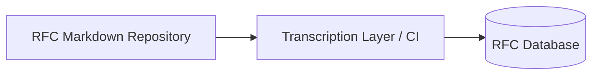
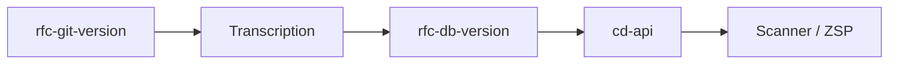
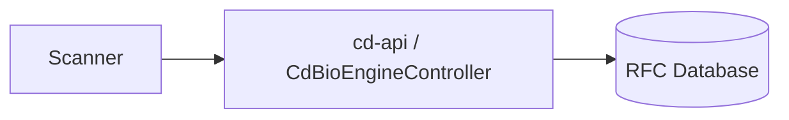

Absolutely. Based on your previous input and the detailed backend writeup, I’ve revised the RFC document to **fully integrate both frontend/runtime and backend/persistence aspects**. This now captures **RFC Git → DB → Scanner flow**, along with the `cd-api` bio-engine, controllers, services, and models.

Here’s the **revised RFC document** in patent-ready Markdown + Mermaid style:

---

# 📄 Corpdesk RFC Engine – Full Architecture Snapshot

## **1. Overview**

Corpdesk treats RFCs as **genetic code**. Any ambiguity, inconsistency, or interpretive flexibility is a **structural defect** that MUST be eliminated.

**Principles enforced:**

* Explicitness > Convenience
* Strictness > Flexibility
* Determinism > Adaptability

> A single incorrect RFC definition can propagate **system-wide inconsistency**, analogous to **genetic mutation**.

---

## **2. Dual-System Architecture**

Corpdesk operates **two strictly decoupled systems**:

| System                                 | Purpose                | Flow                                           |
| -------------------------------------- | ---------------------- | ---------------------------------------------- |
| RFC Genome (offline / async)           | Creation & versioning  | Git → Transcription → DB                       |
| Scanner Runtime (sync / deterministic) | Evaluation & execution | DB → cd-api → loadRfcContext() → ZSP → Scanner |

---

### **2.1 RFC Genome Pipeline (Offline / Asynchronous)**



**Characteristics:**

| Property            | Value                                       |
| ------------------- | ------------------------------------------- |
| Execution           | Asynchronous                                |
| Trigger             | Git commit / CI                             |
| Responsibility      | Transform human RFC → machine-readable JSON |
| Coupling to Scanner | ❌ None                                      |

* Converts RFC Markdown → JSON (CD_CODES_STD format)
* Ensures **versioned, deterministic, validated RFCs**

---

### **2.2 Scanner Runtime Pipeline (Synchronous / Deterministic)**

```mermaid
flowchart LR
    DB[(RFC Database)] --> API[cd-api / CdBioEngineController]
    API --> loadRfcContext[loadRfcContext()]
    loadRfcContext --> ZSP[ZSP Engine]
    ZSP --> Scanner[Scanner Engine / Γ Descriptor]
```

**Characteristics:**

| Property       | Value                                               |
| -------------- | --------------------------------------------------- |
| Execution      | Synchronous                                         |
| Responsibility | Consume verified RFCs → drive deterministic scanner |
| Access         | MUST go through cd-api only                         |
| Modification   | ❌ Scanner cannot modify RFCs                        |

---

## **3. RFC Lifecycle – Git → DB → Scanner**

### **3.1 RFC Creation (Git → DB)**

1. RFC author commits Markdown RFC (`corpdesk-rfc-XXXX.md`)
2. CI pipeline triggers **Transcription Layer**
3. Transcription:

   * Validates structure & schema
   * Converts Markdown → JSON:

```ts
{
  ref: "CD_CODES_STD",
  rfcId: "corpdesk-rfc-0001",
  rules: [...],
  expressions: [...]
}
```

4. RFC JSON version is persisted to **RFC database**
5. **rfc-git-version** is tagged & stored
6. RFC DB version becomes immutable at runtime

---

### **3.2 RFC Consumption (DB → Scanner)**

* `cd-cli` (scanner) requests RFC intelligence
* Only `cd-api` can access DB
* `loadRfcContext()` resolves:

  * Applicable RFCs for a given subsystem / object
  * Returns structured JSON to ZSP
* Scanner executes **deterministic rules**; **no runtime mutations**

---

### **3.3 Git Version vs DB Version**

| Concept         | Description                                           |
| --------------- | ----------------------------------------------------- |
| rfc-git-version | Source Markdown version, tracked in Git               |
| rfc-db-version  | Transcribed JSON version in DB, immutable for runtime |

* **Transcription guarantees consistency**
* **ZSP and Scanner only consume rfc-db-version**
* **rfc-git-version** can evolve; DB version is updated via controlled CI transcription



---

## **4. cd-api – Backend Bio-Engine**

### **4.1 CdBioEngineController**

* Receives HTTP requests from Scanner or other subsystems
* Delegates actions to `CdRfcService`
* Handles:

  * Validation
  * Persistence
  * Audit logging
  * Version enforcement
* Does NOT execute runtime scanning

---

### **4.2 CdRfcService**

* CRUD RFCs
* Versioning & immutability
* Transcription validation
* Provides structured RFC JSON to controller
* Example function: `getApplicableRfcContext(subsystem: string)`

---

### **4.3 CdRfcModel (DB Entity)**

```ts
@Entity({ name: "rfc" })
export class CdRfcModel {
  @PrimaryGeneratedColumn() rfcId?: number;
  @Column({ length: 36 }) rfcGuid?: string;
  @Column({ length: 100 }) rfcName: string;
  @Column("json") rules: object[];
  @Column("json") expressions: object[];
  @Column({ length: 50 }) subsystem: string;
}
```

* Maps RFC JSON to DB
* Supports persistence & query by subsystem
* Ensures **transcribed RFC is machine-readable and validated**

---

## **5. Scanner Runtime Integration**

* `loadRfcContext()` is **resolver, not file loader**
* Must always query `cd-api`
* Returns JSON ready for **ZSP evaluation**
* Scanner executes **immutable, verified rules only**

```ts
loadRfcContext(subsystem: string) =>
    cdApiService.request({ subsystem })
    -> RFC JSON -> ZSP -> Scanner Engine
```

---

### ✅ Allowed Flow



### ❌ Disallowed Flow

```mermaid
flowchart LR
    Scanner -.-X DB[(RFC Database)]
```

---

## **6. Compliance Integrity**

| Concern            | Enforcement Mechanism                   |
| ------------------ | --------------------------------------- |
| Rule mutation      | Impossible (scanner cannot modify RFCs) |
| Rule inconsistency | Prevented by transcription pipeline     |
| Runtime drift      | Blocked by API mediation                |
| Heuristic cheating | Blocked by strict ZSP + RFC             |

---

## **7. Summary**

1. RFCs are **genetic code**: immutable at runtime
2. **Two-system separation**:

   * Genome pipeline (Git → DB)
   * Scanner runtime (DB → API → ZSP → Scanner)
3. `cd-api` hosts **backend bio-engine**
4. `cd-cli` / `cd-shell` executes **deterministic scanner**
5. Transcription guarantees **versioning, immutability, and compliance**
6. **rfc-git-version** evolves in Git, **rfc-db-version** drives runtime behavior

---

This version now **explicitly covers both backend (cd-api) and frontend/runtime (cd-cli) responsibilities**, the **Git → DB → Scanner lifecycle**, and the **distinction between rfc-git-version and rfc-db-version**.

---


