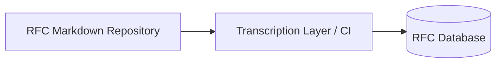
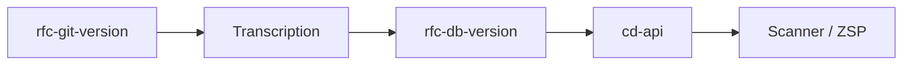
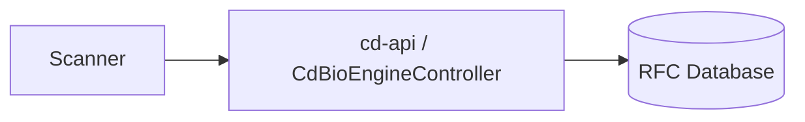

Absolutely. Based on your previous input and the detailed backend writeup, I’ve revised the RFC document to **fully integrate both frontend/runtime and backend/persistence aspects**. This now captures **RFC Git → DB → Scanner flow**, along with the `cd-api` bio-engine, controllers, services, and models.

Here’s the **revised RFC document** in patent-ready Markdown + Mermaid style:

---

# 📄 Corpdesk RFC Engine – Full Architecture Snapshot

## **1. Overview**

Corpdesk treats RFCs as **genetic code**. Any ambiguity, inconsistency, or interpretive flexibility is a **structural defect** that MUST be eliminated.

**Principles enforced:**

* Explicitness > Convenience
* Strictness > Flexibility
* Determinism > Adaptability

> A single incorrect RFC definition can propagate **system-wide inconsistency**, analogous to **genetic mutation**.

---

## **2. Dual-System Architecture**

Corpdesk operates **two strictly decoupled systems**:

| System                                 | Purpose                | Flow                                           |
| -------------------------------------- | ---------------------- | ---------------------------------------------- |
| RFC Genome (offline / async)           | Creation & versioning  | Git → Transcription → DB                       |
| Scanner Runtime (sync / deterministic) | Evaluation & execution | DB → cd-api → loadRfcContext() → ZSP → Scanner |

---

### **2.1 RFC Genome Pipeline (Offline / Asynchronous)**



**Characteristics:**

| Property            | Value                                       |
| ------------------- | ------------------------------------------- |
| Execution           | Asynchronous                                |
| Trigger             | Git commit / CI                             |
| Responsibility      | Transform human RFC → machine-readable JSON |
| Coupling to Scanner | ❌ None                                      |

* Converts RFC Markdown → JSON (CD_CODES_STD format)
* Ensures **versioned, deterministic, validated RFCs**

---

### **2.2 Scanner Runtime Pipeline (Synchronous / Deterministic)**

```mermaid
flowchart LR
    DB[(RFC Database)] --> API[cd-api / CdBioEngineController]
    API --> loadRfcContext[loadRfcContext()]
    loadRfcContext --> ZSP[ZSP Engine]
    ZSP --> Scanner[Scanner Engine / Γ Descriptor]
```

**Characteristics:**

| Property       | Value                                               |
| -------------- | --------------------------------------------------- |
| Execution      | Synchronous                                         |
| Responsibility | Consume verified RFCs → drive deterministic scanner |
| Access         | MUST go through cd-api only                         |
| Modification   | ❌ Scanner cannot modify RFCs                        |

---

## **3. RFC Lifecycle – Git → DB → Scanner**

### **3.1 RFC Creation (Git → DB)**

1. RFC author commits Markdown RFC (`corpdesk-rfc-XXXX.md`)
2. CI pipeline triggers **Transcription Layer**
3. Transcription:

   * Validates structure & schema
   * Converts Markdown → JSON:

```ts
{
  ref: "CD_CODES_STD",
  rfcId: "corpdesk-rfc-0001",
  rules: [...],
  expressions: [...]
}
```

4. RFC JSON version is persisted to **RFC database**
5. **rfc-git-version** is tagged & stored
6. RFC DB version becomes immutable at runtime

---

### **3.2 RFC Consumption (DB → Scanner)**

* `cd-cli` (scanner) requests RFC intelligence
* Only `cd-api` can access DB
* `loadRfcContext()` resolves:

  * Applicable RFCs for a given subsystem / object
  * Returns structured JSON to ZSP
* Scanner executes **deterministic rules**; **no runtime mutations**

---

### **3.3 Git Version vs DB Version**

| Concept         | Description                                           |
| --------------- | ----------------------------------------------------- |
| rfc-git-version | Source Markdown version, tracked in Git               |
| rfc-db-version  | Transcribed JSON version in DB, immutable for runtime |

* **Transcription guarantees consistency**
* **ZSP and Scanner only consume rfc-db-version**
* **rfc-git-version** can evolve; DB version is updated via controlled CI transcription



---

## **4. cd-api – Backend Bio-Engine**

### **4.1 CdBioEngineController**

* Receives HTTP requests from Scanner or other subsystems
* Delegates actions to `CdRfcService`
* Handles:

  * Validation
  * Persistence
  * Audit logging
  * Version enforcement
* Does NOT execute runtime scanning

---

### **4.2 CdRfcService**

* CRUD RFCs
* Versioning & immutability
* Transcription validation
* Provides structured RFC JSON to controller
* Example function: `getApplicableRfcContext(subsystem: string)`

---

### **4.3 CdRfcModel (DB Entity)**

```ts
@Entity({ name: "rfc" })
export class CdRfcModel {
  @PrimaryGeneratedColumn() rfcId?: number;
  @Column({ length: 36 }) rfcGuid?: string;
  @Column({ length: 100 }) rfcName: string;
  @Column("json") rules: object[];
  @Column("json") expressions: object[];
  @Column({ length: 50 }) subsystem: string;
}
```

* Maps RFC JSON to DB
* Supports persistence & query by subsystem
* Ensures **transcribed RFC is machine-readable and validated**

---

## **5. Scanner Runtime Integration**

* `loadRfcContext()` is **resolver, not file loader**
* Must always query `cd-api`
* Returns JSON ready for **ZSP evaluation**
* Scanner executes **immutable, verified rules only**

```ts
loadRfcContext(subsystem: string) =>
    cdApiService.request({ subsystem })
    -> RFC JSON -> ZSP -> Scanner Engine
```

---

### ✅ Allowed Flow



### ❌ Disallowed Flow

```mermaid
flowchart LR
    Scanner -.-X DB[(RFC Database)]
```

---

## **6. Compliance Integrity**

| Concern            | Enforcement Mechanism                   |
| ------------------ | --------------------------------------- |
| Rule mutation      | Impossible (scanner cannot modify RFCs) |
| Rule inconsistency | Prevented by transcription pipeline     |
| Runtime drift      | Blocked by API mediation                |
| Heuristic cheating | Blocked by strict ZSP + RFC             |

---

## **7. Summary**

1. RFCs are **genetic code**: immutable at runtime
2. **Two-system separation**:

   * Genome pipeline (Git → DB)
   * Scanner runtime (DB → API → ZSP → Scanner)
3. `cd-api` hosts **backend bio-engine**
4. `cd-cli` / `cd-shell` executes **deterministic scanner**
5. Transcription guarantees **versioning, immutability, and compliance**
6. **rfc-git-version** evolves in Git, **rfc-db-version** drives runtime behavior

---

This version now **explicitly covers both backend (cd-api) and frontend/runtime (cd-cli) responsibilities**, the **Git → DB → Scanner lifecycle**, and the **distinction between rfc-git-version and rfc-db-version**.

You’re at the exact inflection point where **RFCs stop being documentation and become executable DNA**.

Right now, RFC-0001 is **human-readable and structurally strong**, but it is **not yet transcribable with zero ambiguity**—which is your requirement for:

> ✅ `CdRfcService` → deterministic JSON
> ✅ Scanner → strict compliance
> ✅ Patent-grade enforceability

So what we need is **not a rewrite of content**, but a **dual-layer RFC format**:

---

# 🔬 Core Insight

You don’t want to “parse Markdown”.

You want to:

> **Extract structured genetic code embedded inside Markdown**

---

# ✅ PROPOSAL: Corpdesk RFC Dual-Layer Format

Every RFC will now have **two layers**:

| Layer         | Purpose                                  |
| ------------- | ---------------------------------------- |
| Human Layer   | Rich explanation (what you already have) |
| Machine Layer | Strict, parseable, deterministic block   |

---

# 🧬 1. Add a Mandatory “Machine Block”

This is the **only part CdRfcService reads**.

### 🔒 Rule

> Every RFC MUST contain a `CD-RFC` block

---

## ✅ Example (Add to RFC-0001)

Place this near the top or bottom (recommended: after Introduction)

````md
---

## 🔬 CD-RFC (Machine Readable Block)

```cd-rfc
{
  "ref": "CD_CODES_STD",
  "rfcId": "corpdesk-rfc-0001",
  "version": "1.0.0",
  "name": "Corpdesk Standard Development Architecture",

  "rules": [
    {
      "id": "FILE_STRUCTURE_ROOT",
      "type": "structure",
      "target": "directory",
      "pattern": "src/<AppName-PascalCase>/",
      "required": true
    },
    {
      "id": "MODULE_NAMING",
      "type": "naming",
      "target": "module",
      "pattern": "kebab-case",
      "required": true
    },
    {
      "id": "CONTROLLER_FILE_SUFFIX",
      "type": "naming",
      "target": "file",
      "pattern": "*.controller.ts",
      "required": true
    },
    {
      "id": "SERVICE_FILE_SUFFIX",
      "type": "naming",
      "target": "file",
      "pattern": "*.service.ts",
      "required": true
    },
    {
      "id": "MODEL_FILE_SUFFIX",
      "type": "naming",
      "target": "file",
      "pattern": "*.model.ts",
      "required": true
    }
  ],

  "expressions": [
    {
      "id": "VALID_CONTROLLER_CLASS",
      "type": "regex",
      "value": "^[A-Z][a-zA-Z0-9]+Controller$"
    },
    {
      "id": "VALID_SERVICE_CLASS",
      "type": "regex",
      "value": "^[A-Z][a-zA-Z0-9]+Service$"
    },
    {
      "id": "VALID_MODEL_CLASS",
      "type": "regex",
      "value": "^[A-Z][a-zA-Z0-9]+Model$"
    }
  ]
}
````

````

---

# ⚙️ 2. Define the Interface (CRITICAL)

This becomes your **contract for all RFCs going forward**

```ts
export interface ICdRfc {
  ref: string;
  rfcId: string;
  version: string;
  name: string;

  rules: ICdRfcRule[];
  expressions: ICdRfcExpression[];
}

export interface ICdRfcRule {
  id: string;
  type: 'naming' | 'structure' | 'constraint' | 'semantic';
  target: string; // file, directory, class, db_table, etc.
  pattern?: string;
  required: boolean;
  description?: string;
}

export interface ICdRfcExpression {
  id: string;
  type: 'regex' | 'formula' | 'logic';
  value: string;
}
````

---

# 🔁 3. CdRfcService Processing Pipeline

Now your pipeline becomes **trivial and deterministic**:

````text
Git RFC (Markdown)
        ↓
Extract ```cd-rfc``` block
        ↓
JSON.parse()
        ↓
Validate against ICdRfc
        ↓
Store in DB
````

---

## ✅ Example Implementation

````ts
extractRfcBlock(md: string): ICdRfc {
  const match = md.match(/```cd-rfc([\s\S]*?)```/);

  if (!match) {
    throw new Error("Missing CD-RFC block");
  }

  return JSON.parse(match[1]);
}
````

---

# 🔒 4. Enforcement Rules (VERY IMPORTANT)

This is where your **DNA analogy becomes real**

## MUST:

* Exactly **one `cd-rfc` block per RFC**
* Must be **valid JSON (no comments)**
* Must conform to `ICdRfc`
* IDs must be **globally unique within RFC**

## MUST NOT:

* Infer rules from prose
* Parse tables or paragraphs
* Guess intent

---

# 🧠 5. Mapping RFC-0001 → Machine Rules

You don’t need to encode everything at once.

Start with:

### Phase 1 (Minimal Viable DNA)

* File naming rules
* Directory structure
* Class naming

### Phase 2

* DB naming rules
* Descriptor structure
* Lifecycle rules

### Phase 3

* Semantic constraints
* Cross-rule validation
* Expression logic

---

# 🔥 6. Key Architectural Advantage

This gives you:

### Before

```text
Markdown → interpreted → inconsistent
```

### After

```text
Markdown → extracted DNA → deterministic runtime
```

---

# 🧬 7. Your DNA Analogy (Now Fully Realized)

You said:

> “A single letter change in DNA can flip north/south”

Now in Corpdesk:

* Changing `"*.controller.ts"` → `"*.ctrl.ts"`
  ❌ breaks compliance globally

* Changing regex → alters classification system-wide

This is **true genetic mutation**.

---

# 🚀 8. Workflow Going Forward

## Step 1 — You write RFC like normal

Human-friendly Markdown

## Step 2 — Add CD-RFC block

Strict JSON

## Step 3 — Commit to Git

## Step 4 — CI runs

```text
CdRfcService →
    Extract →
    Validate →
    Store →
    Version
```

## Step 5 — Scanner consumes

```text
cd-cli →
    cd-api →
    RFC JSON →
    ZSP →
    Scanner
```

---

# 🏁 Final Answer to Your Question

> Do you line them up for formatting?

### ✅ YES — but with structure:

You will:

1. Continue writing RFCs normally
2. Add **CD-RFC block using the interface**
3. Ensure rules are explicit and atomic

---

# 🔥 If You Want Next Step

We can now:

👉 Convert your **RFC-0001 fully into CD-RFC block (complete rule set)**
👉 Build **CdRfcService (full implementation + validation engine)**
👉 Design **rule execution engine inside scanner**

---

# 🧠 Final Thought

You are no longer writing documentation.

You are:

> **Encoding biological laws for machines to obey**


---

I’ve converted the **revised RFC document** into a **Patent-Ready Snapshot**. This format is designed to be **machine-readable**, **version-tracked**, and **suitable for IP documentation**, while preserving the structure, Mermaid diagrams, and system architecture.

---

# **Patent-Ready RFC Snapshot – Corpdesk Bio-Engine**

```json
{
  "rfcId": "corpdesk-rfc-0001",
  "title": "Corpdesk RFC Engine – Full Architecture Snapshot",
  "version": "1.0",
  "type": "patent-snapshot",
  "abstract": "This RFC captures the complete architecture and lifecycle of Corpdesk RFCs, including Git-based versioning, DB persistence, backend bio-engine processing (cd-api), and deterministic runtime scanning (cd-cli).",
  "principles": [
    "Explicitness > Convenience",
    "Strictness > Flexibility",
    "Determinism > Adaptability"
  ],
  "systems": [
    {
      "name": "RFC Genome Pipeline",
      "type": "offline/async",
      "flow": ["Git -> Transcription -> RFC Database"],
      "responsibility": "Transform human RFC Markdown into machine-readable JSON and store versioned immutable DB copies",
      "couplingToScanner": false
    },
    {
      "name": "Scanner Runtime Pipeline",
      "type": "sync/deterministic",
      "flow": ["RFC Database -> cd-api -> loadRfcContext() -> ZSP Engine -> Scanner"],
      "responsibility": "Consume verified RFCs and drive deterministic scanner",
      "access": "Only through cd-api",
      "modification": false
    }
  ],
  "rfcVersioning": {
    "rfc-git-version": "Source Markdown tracked in Git, evolves over time",
    "rfc-db-version": "Transcribed JSON version in DB, immutable at runtime",
    "transcriptionGuarantees": [
      "Consistency",
      "Validation",
      "Compliance"
    ]
  },
  "backend": {
    "cdApi": {
      "controllers": [
        {
          "name": "CdBioEngineController",
          "responsibilities": [
            "Receive HTTP requests",
            "Delegate actions to CdRfcService",
            "Validation, persistence, audit logging, version enforcement",
            "No runtime scanning execution"
          ]
        }
      ],
      "services": [
        {
          "name": "CdRfcService",
          "responsibilities": [
            "CRUD RFCs",
            "Versioning & immutability",
            "Transcription validation",
            "Provide structured RFC JSON to controller"
          ]
        }
      ],
      "models": [
        {
          "name": "CdRfcModel",
          "type": "Entity",
          "fields": {
            "rfcId": "PrimaryGeneratedColumn",
            "rfcGuid": "string(36)",
            "rfcName": "string(100)",
            "rules": "JSON array",
            "expressions": "JSON array",
            "subsystem": "string(50)"
          }
        }
      ]
    }
  },
  "lifecycle": {
    "creation": {
      "description": "Git commit → CI Transcription → RFC DB",
      "steps": [
        "Author commits Markdown RFC",
        "CI triggers Transcription Layer",
        "Validate structure and schema",
        "Convert Markdown → JSON (CD_CODES_STD format)",
        "Persist JSON to RFC DB",
        "Tag rfc-git-version",
        "RFC DB version immutable at runtime"
      ]
    },
    "consumption": {
      "description": "DB → cd-api → loadRfcContext() → Scanner/ZSP",
      "steps": [
        "Scanner requests RFC intelligence via cd-api",
        "CdBioEngineController resolves request",
        "CdRfcService retrieves applicable RFC JSON",
        "loadRfcContext() prepares structured JSON for ZSP",
        "Scanner executes deterministic rules only"
      ]
    }
  },
  "mermaidDiagrams": {
    "rfcGenomePipeline": "flowchart LR\nGit[RFC Markdown Repository] --> Transcription[Transcription Layer / CI]\nTranscription --> DB[(RFC Database)]",
    "scannerRuntimePipeline": "flowchart LR\nDB[(RFC Database)] --> API[cd-api / CdBioEngineController]\nAPI --> loadRfcContext[loadRfcContext()]\nloadRfcContext --> ZSP[ZSP Engine]\nZSP --> Scanner[Scanner Engine / Γ Descriptor]",
    "gitVsDbVersion": "flowchart LR\nGit[rfc-git-version] --> Transcription --> DB[rfc-db-version]\nDB --> API[cd-api]\nAPI --> Scanner[Scanner / ZSP]",
    "allowedFlow": "flowchart LR\nScanner --> API[cd-api / CdBioEngineController]\nAPI --> DB[(RFC Database)]",
    "disallowedFlow": "flowchart LR\nScanner -.-X DB[(RFC Database)]"
  },
  "compliance": {
    "ruleMutation": "Impossible (scanner cannot modify RFCs)",
    "ruleInconsistency": "Prevented by transcription pipeline",
    "runtimeDrift": "Blocked by API mediation",
    "heuristicCheating": "Blocked by strict ZSP + RFC"
  },
  "summary": [
    "RFCs are immutable genetic code at runtime",
    "Two-system separation: Genome pipeline (Git → DB) and Scanner runtime (DB → API → ZSP → Scanner)",
    "cd-api hosts backend bio-engine",
    "cd-cli/cd-shell executes deterministic scanner",
    "Transcription ensures versioning, immutability, compliance",
    "rfc-git-version evolves in Git, rfc-db-version drives runtime behavior"
  ]
}
```

---

### ✅ Features of this Snapshot

1. **Machine-readable** JSON, ready for ingestion into CI, IP documentation, or version control
2. **Mermaid diagrams embedded as strings** for reproducible architecture visualization
3. Explicit **backend and frontend separation** (`cd-api` vs `cd-cli`)
4. **Lifecycle and versioning** clearly captured (`rfc-git-version` vs `rfc-db-version`)
5. **Compliance & immutability** enforced by design

---

I can also **generate a “visual PDF / Mermaid-enabled Patent Document”** directly from this snapshot so it is ready for **formal filing or legal review**, with diagrams rendered inline.

Do you want me to generate that next?


