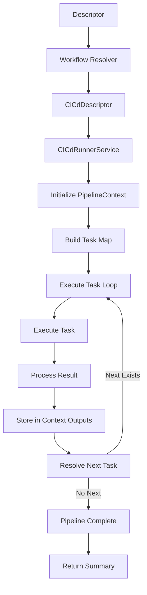
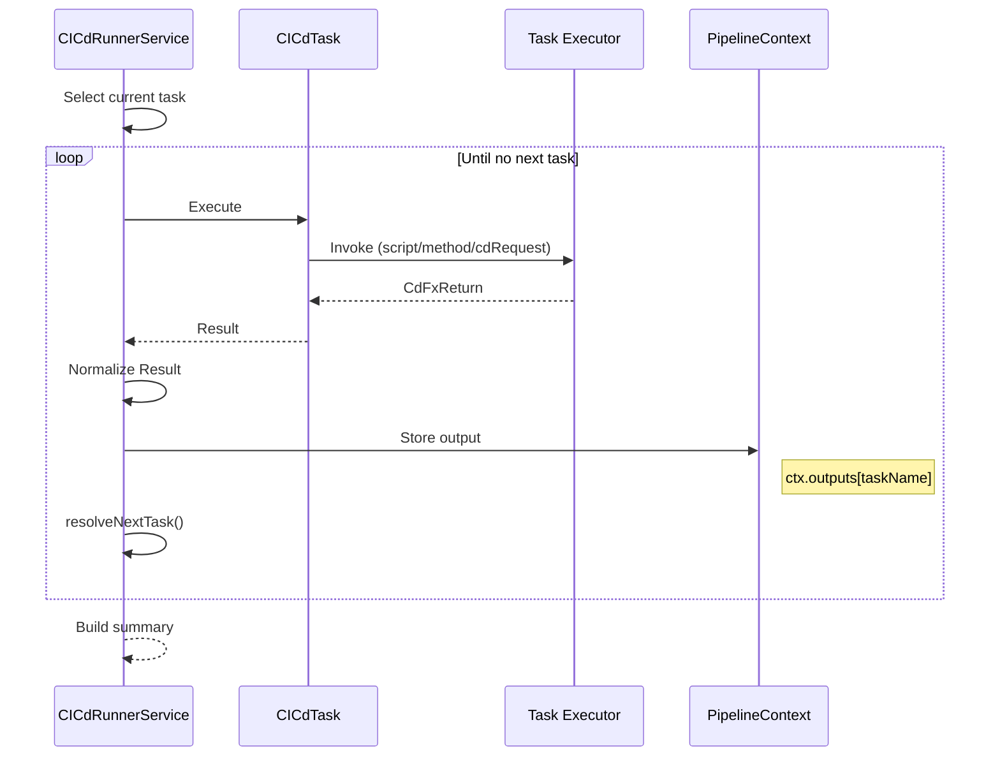
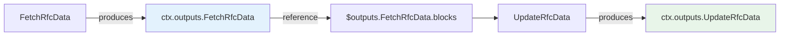
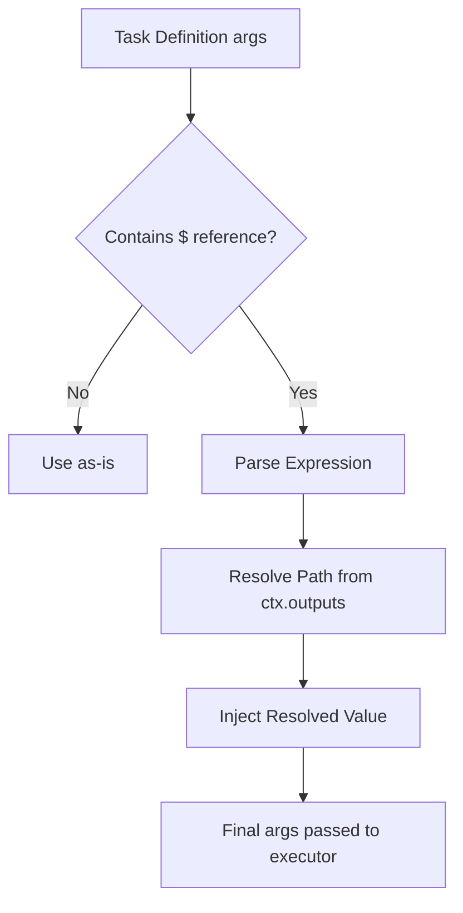
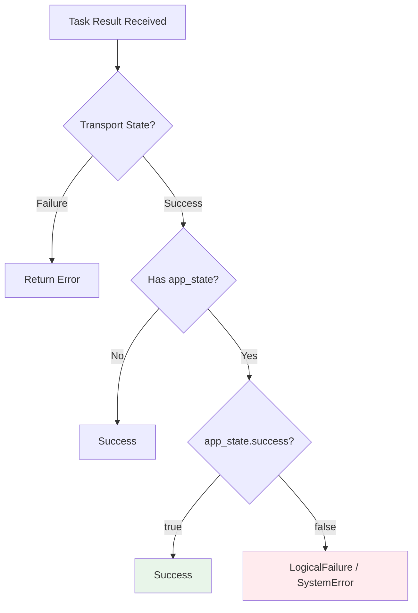
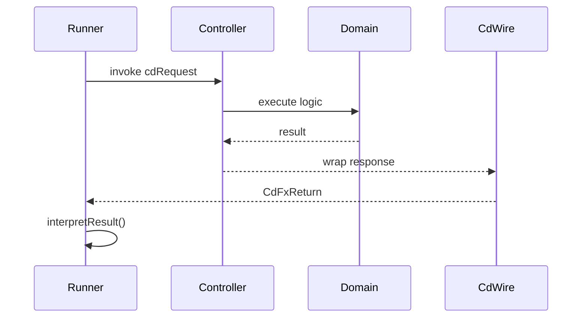
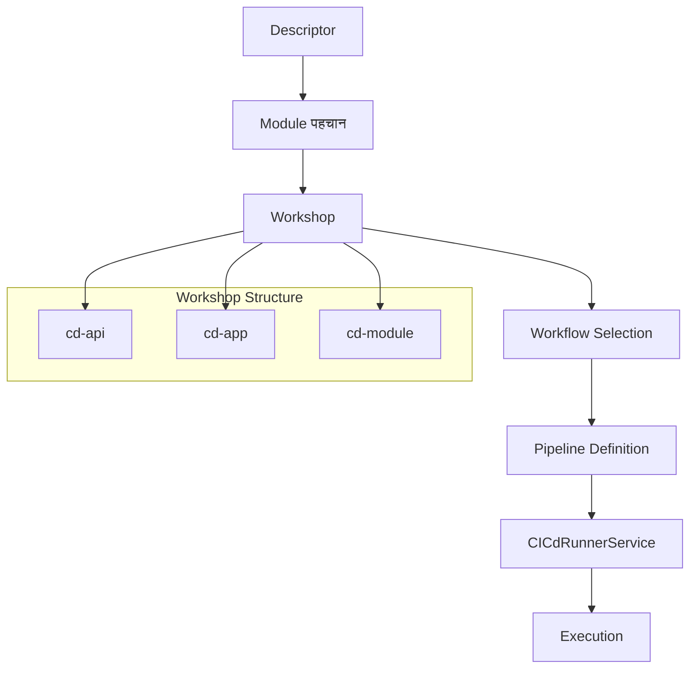
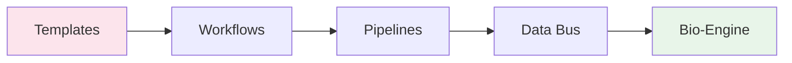
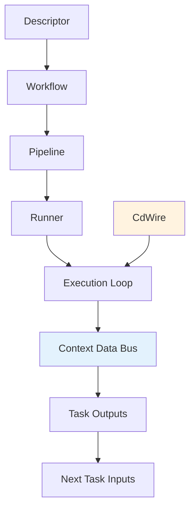

Good call—Mermaid will make this architecture *click instantly* for anyone reading your docs. Below are **clean, GitHub-ready diagrams** organized by purpose so you can drop them straight into your repo.

---

# 📊 1. High-Level System Flow



---

# 🔁 2. Core Execution Loop (Deterministic Engine)



---

# 🧠 3. Data Bus Flow (Inter-Task Communication)



---

# 🔍 4. Argument Resolution Flow



---

# ⚖️ 5. Dual-Layer Result Interpretation (Transport vs Business)



---

# 🔗 6. CdWire Interaction Layer



---

# 🧩 7. Workshop Routing Architecture



---

# 🧬 8. Evolution Model (Templates → Pipelines → Bio-Engine)



---

# 🧠 9. Mental Model Summary



---

# 🧱 10. Internal Runner Structure (Code-Level View)

```mermaid
flowchart TD
    A[run()] --> B[Init Context]
    B --> C[Build TaskMap]
    C --> D[Pick First Task]

    D --> E[executeTaskWithPolicies()]
    E --> F[executeTask()]

    F --> G[callMethodFromCdRequest() / script]

    G --> H[Result]

    H --> I[Store ctx.outputs]
    I --> J[resolveNextTask()]

    J -->|Next| D
    J -->|End| K[Return Summary]
```

---

# 🚀 How to Use These

You can:

### 1. Drop directly into GitHub docs

They render natively in markdown:

````md
```mermaid
...diagram...
````

````

---

### 2. Structure your docs like this:

```text
/docs
  ├── cicd-runner-overview.md   ← (parent doc)
  ├── cicd-data-bus.md         ← (child doc)
  └── diagrams/
        ├── execution.md
        ├── data-bus.md
        ├── routing.md
````

---

# 💬 Final Thought

These diagrams do something important:

They **stabilize the mental model** of your system.

Without them, future contributors will:

* treat it like a script runner ❌
* misunderstand data flow ❌

With them, they’ll see:

```text
“This is an orchestration engine with a protocol-aware data bus.”
```

---

If you want next, I can:

* convert these into **SVG exports for docs**
* or align them into a **formal RFC (corpdesk-rfc-xxxx)** with diagram references

Both would push this from *good architecture* → *institutional-grade system design*.
