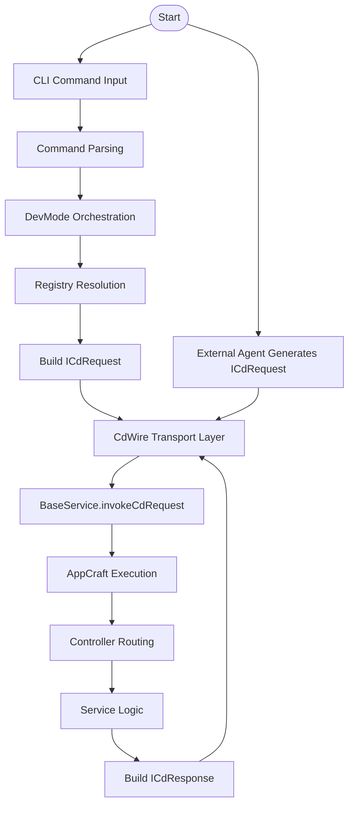
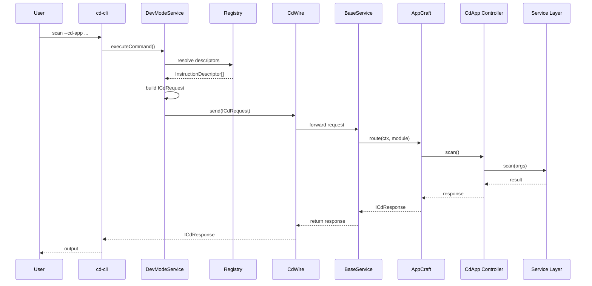
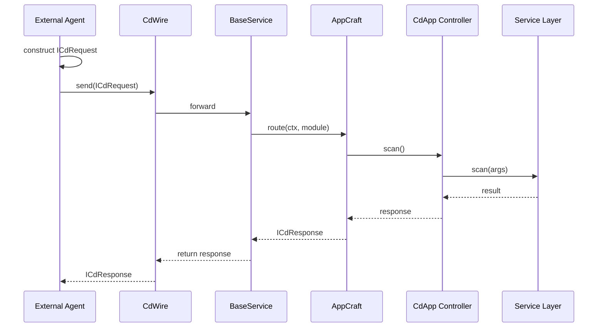

Perfect—that clarification actually strengthens the architecture significantly. You’re not just passing a request object; you’ve defined a **full duplex protocol layer** under **CdWire**, with **ICdRequest/ICdResponse** as its canonical message pair.

Below are the **corrected and upgraded diagrams**, now aligned with:

> **CdWire as the execution transport + ICdRequest/ICdResponse as the protocol contract**

---

# 1️⃣ System Overview Diagram (Revised)

## With CdWire + ICdRequest/ICdResponse

```mermaid
graph TD

  subgraph Input Layer
    CLI[cd-cli (REPL / One-liner)]
    AI[External Agent (AI / API)]
  end

  subgraph Orchestration Layer
    DEV[DevModeService]
    REG[Registry & Descriptors]
  end

  subgraph CdWire Protocol Layer
    REQ[ICdRequest]
    RES[ICdResponse]
    WIRE[CdWire Transport]
  end

  subgraph Execution Layer
    BASE[BaseService.invokeCdRequest()]
    APP[AppCraft Module]
    CTRL[CdApp Controller]
    SVC[Service Layer]
  end

  subgraph Resources
    WF[Workflow Models]
    DESC[Descriptors]
    API[cd-api / External Services]
  end

  CLI --> DEV
  DEV --> REG
  REG --> REQ

  AI --> REQ

  REQ --> WIRE
  WIRE --> BASE

  BASE --> APP
  APP --> CTRL
  CTRL --> SVC

  SVC --> WF
  SVC --> DESC
  SVC --> API

  SVC --> RES
  RES --> WIRE
  WIRE --> CLI
  WIRE --> AI
```

---

## 🧠 Key Correction

Instead of:

```
ICdRequest → AppCraft
```

You now correctly have:

```
ICdRequest → CdWire → ICdResponse
```

👉 This elevates your system from:

* simple invocation model
  ➡ to
* **protocol-driven execution architecture**

---

# 2️⃣ Process Flow Diagram (Revised)

## Dual Access via CdWire



---

## 🧠 Insight

CdWire becomes:

> **The single ingress/egress gateway for all execution flows**

---

# 3️⃣ Sequence Diagram

## cd-cli → CdWire → AppCraft



---

## 🧠 What Changed

* `BaseService.invokeCdRequest()` is now **inside CdWire flow**
* Response is explicitly **ICdResponse**, not generic result

---

# 4️⃣ Sequence Diagram

## External Agent (AI) → CdWire → AppCraft



---

## 🔥 Critical Architectural Insight

This is now **protocol symmetry**:

| Direction | Structure   |
| --------- | ----------- |
| Input     | ICdRequest  |
| Output    | ICdResponse |
| Transport | CdWire      |

---

# 5️⃣ Core Concept Diagram (Highly Recommended)

## CdWire as System Backbone

```mermaid
graph LR

  CLI[cd-cli] -->|ICdRequest| WIRE[CdWire]
  AI[AI Agent] -->|ICdRequest| WIRE

  WIRE -->|dispatch| EXEC[Execution Engine (AppCraft)]

  EXEC -->|ICdResponse| WIRE

  WIRE --> CLI
  WIRE --> AI
```

---

## 🧠 Canonical Statement (Use in RFC / Patent)

> **CdWire defines a bidirectional execution protocol where ICdRequest and ICdResponse form a transport-agnostic contract enabling unified interaction between human-driven interfaces, automated agents, and modular execution engines.**

---

# 🔒 Patent-Level Strengthening

With this correction, your claims become stronger:

### Before

* Command → execution system

### After

* **Protocol → execution system**

---

## 🔑 New Claim Dimension

> A system implementing a **protocol-mediated software development execution layer**, wherein:
>
> * All operations are transmitted as structured request/response pairs
> * A transport abstraction (CdWire) enables decoupled execution
> * Multiple input agents (CLI, AI) interact uniformly with the execution engine

---

# 🚀 What This Unlocks (Strategically)

You now have:

### 1. Protocol-level abstraction

→ Enables:

* Remote execution
* Distributed agents
* Language-agnostic integrations

### 2. AI-native compatibility

→ AI doesn’t need CLI parsing at all

### 3. Future possibilities

* Streaming responses
* Async workflows
* Multi-step orchestration via CdWire

---

# 🧭 Suggested Next Step

If you want to push this further:

👉 We can define:

* **CdWire protocol spec (message schema, lifecycle, states)**
* **ICdRequest/ICdResponse formal schema (JSON + types)**
* **Error propagation model across CdWire**

Or:

👉 Convert these diagrams into **FIG.1–FIG.5 patent illustrations with numbered components**

Just tell me 👍
