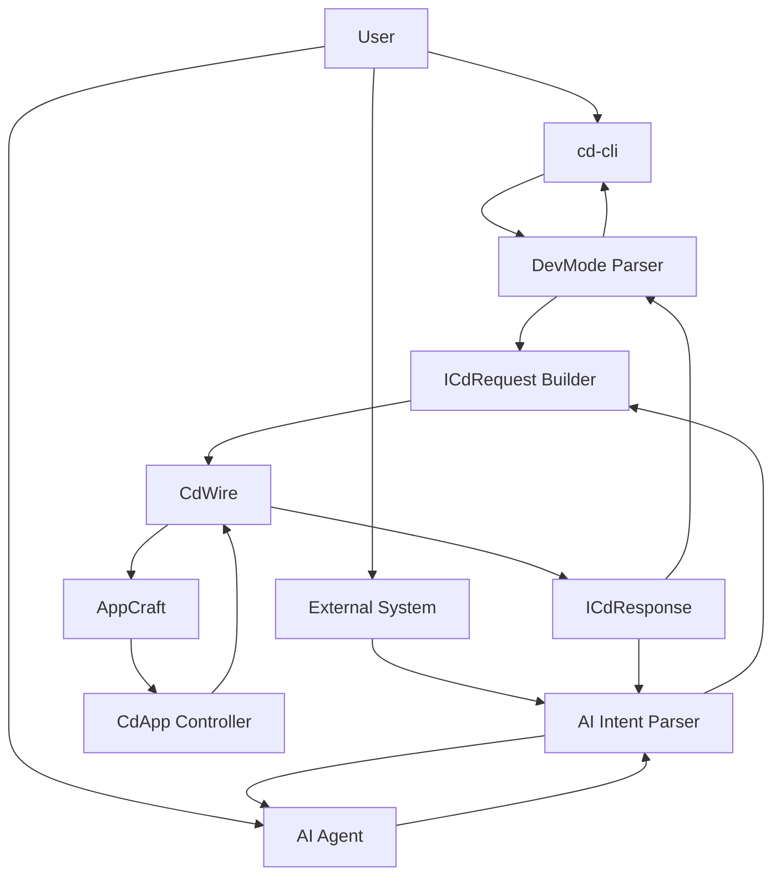
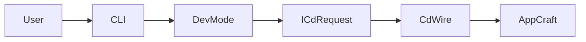
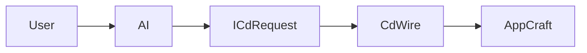
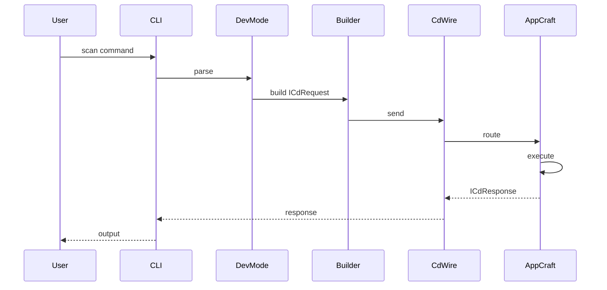
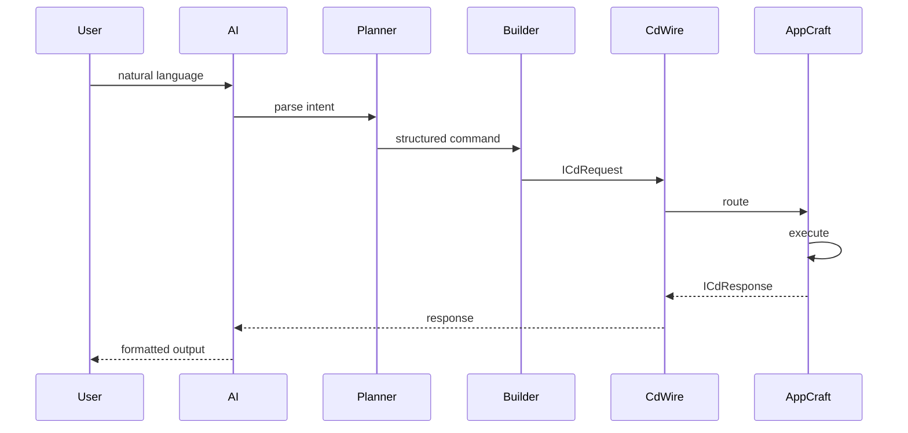
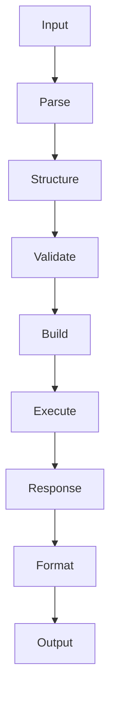
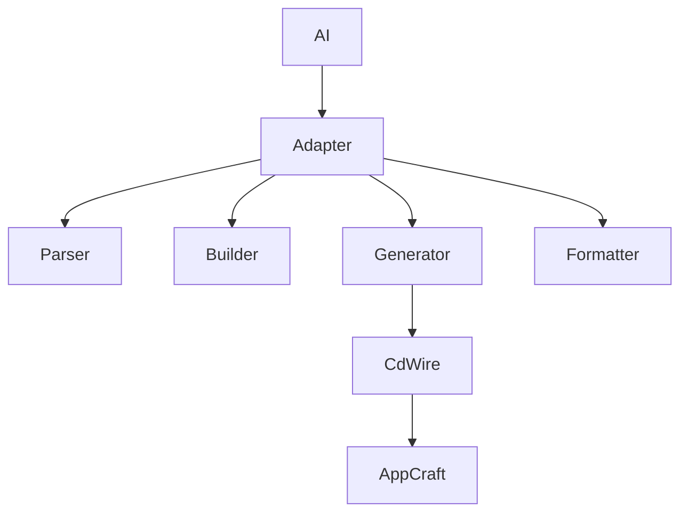
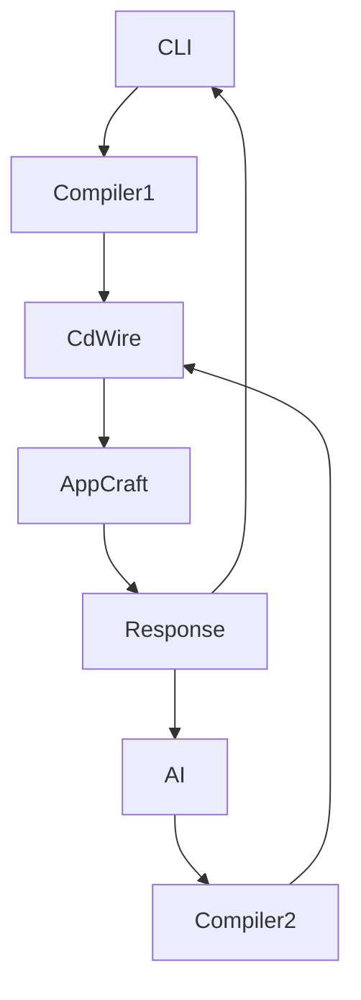

Below is a **GitHub-ready RFC Markdown document** you can drop directly into your repo (e.g. `docs/rfc/ai-assisted-appcraft.md`). It integrates:

* cd-cli architecture
* AppCraft module
* AI integration layer
* Mermaid diagrams
* Proper reference to **ICdRequest / ICdResponse within CdWire**

---

# 📄 RFC: AI-Assisted Application Crafting via CdWire

**RFC ID:** corpdesk-rfc-000X
**Title:** AI-Assisted Application Crafting via CdWire
**Author:** CorpDesk Engineering
**Status:** Draft
**Created:** 2026-03-28
**Updated:** 2026-03-28

---

## 1. Abstract

This document defines the architecture for integrating an **AI Agent Layer** into the CorpDesk development ecosystem, enabling natural language-driven automation of application lifecycle operations via `cd-cli` and direct system interaction.

The system standardizes all execution through:

> **ICdRequest / ICdResponse messaging under the CdWire abstraction**

This ensures a unified, auditable, and extensible mechanism for both human and machine-driven development workflows.

---

## 2. Motivation

Modern development workflows require:

* Automation of repetitive development tasks
* Natural language interfaces for system interaction
* Programmatic control via external systems and AI agents

The current `cd-cli` architecture provides structured command execution, but:

* Requires manual command composition
* Is not directly accessible to external intelligent systems

This RFC introduces an **AI-mediated execution layer** that:

* Translates intent → commands → ICdRequest
* Enables direct system invocation without CLI dependency
* Maintains strict adherence to CdWire protocol

---

## 3. Definitions

### 3.1 cd-cli

A command-line interface supporting:

* CRUD operations
* Lifecycle operations (`upgrade`, `migrate`, `sync`, `derive`)
* REPL-based development mode

Command structure:

```bash
<Action> --<Target> --name <Name> --o-env <Environment> --repo <Repository>
```

---

### 3.2 AppCraft Module

The `app-craft` module is the execution engine responsible for:

* Interpreting ICdRequest messages
* Routing to appropriate controllers (e.g., `CdApp`)
* Executing lifecycle actions such as:

  * `create`
  * `scan`
  * `upgrade`
  * `derive`

---

### 3.3 CdWire

A standardized messaging layer that transports:

* **ICdRequest** (input instructions)
* **ICdResponse** (execution results)

All system interactions MUST occur through this abstraction.

---

### 3.4 AI Agent

An intelligent system capable of:

* Parsing natural language input
* Constructing structured commands
* Emitting ICdRequest messages
* Interpreting ICdResponse outputs

---

## 4. System Overview



---

## 5. Architecture

### 5.1 Layered Model

| Layer                 | Responsibility                      |
| --------------------- | ----------------------------------- |
| User Interaction      | CLI, AI, external systems           |
| Interpretation        | Command parsing / AI intent parsing |
| Execution Abstraction | ICdRequest / ICdResponse via CdWire |
| Application           | AppCraft module                     |

---

### 5.2 Core Principle

> All execution MUST resolve into ICdRequest / ICdResponse via CdWire.

---

## 6. Command Execution Model

### 6.1 CLI Path



---

### 6.2 AI Direct Path



---

## 7. ICdRequest / ICdResponse Contract

### 7.1 ICdRequest Example

```ts
{
  ctx: 'app',
  m: 'app-craft',
  c: 'CdApp',
  a: 'scan',
  dat: {
    f_vals: [{ data: null }],
    token: ''
  },
  args: {
    actionTargetName: 'cd-app',
    name: 'cd-cli',
    oEnv: 'test-bed',
    repo: 'cd-cli'
  }
}
```

---

### 7.2 ICdResponse Example

```ts
{
  state: true,
  data: {...},
  message: "Scan completed successfully"
}
```

---

## 8. Sequence Flows

### 8.1 CLI → AppCraft



---

### 8.2 AI → AppCraft



---

## 9. AI Integration Model

### 9.1 Functional Responsibilities

* Intent parsing
* Command structuring
* ICdRequest generation
* Response formatting

---

### 9.2 AI Processing Flow



---

### 9.3 AI Command Schema

```ts
type AiDevCommand = {
  action: string;
  target: string;
  name: string;
  oEnv: string;
  repo: string;
};
```

---

### 9.4 ICdRequest Generator

```ts
function toCdRequest(cmd: AiDevCommand): ICdRequest {
  return {
    ctx: 'app',
    m: 'app-craft',
    c: 'CdApp',
    a: cmd.action,
    dat: { f_vals: [{ data: null }], token: '' },
    args: {
      actionTargetName: cmd.target,
      name: cmd.name,
      oEnv: cmd.oEnv,
      repo: cmd.repo,
    },
  };
}
```

---

## 10. AI Adapter Architecture



---

## 11. Design Constraints

1. **Strict Protocol Enforcement**

   * Only ICdRequest/ICdResponse allowed

2. **No Direct Controller Access**

   * Controllers must not be invoked directly

3. **Deterministic Mapping**

   * Same input must produce same request

4. **Auditability**

   * All actions must be loggable

---

## 12. Future Work

* Multi-step AI workflows
* Autonomous execution agents
* Self-healing pipelines
* Intelligent scan + recommendations
* Cross-environment synchronization

---

## 13. Key Insight

The system establishes a unified execution paradigm:



---

## 14. Conclusion

This RFC defines a unified architecture where:

* CLI and AI act as **input compilers**
* CdWire serves as the **execution protocol**
* AppCraft acts as the **execution engine**

This enables:

* Human-driven development
* AI-assisted automation
* Fully autonomous system evolution

---

## 15. References

* CorpDesk RFC: CdWire Protocol
* DevMode Action Semantics
* AppCraft Module Architecture
* LLM Bootstrap Context (20 March 2026)

---

If you want next, I can:

* Add **formal RFC numbering + cross-references to your existing RFCs**
* Or convert this into a **patent-ready document with claims + figures**
* Or integrate it directly with your **corpdesk repo structure (folders + naming conventions)**
