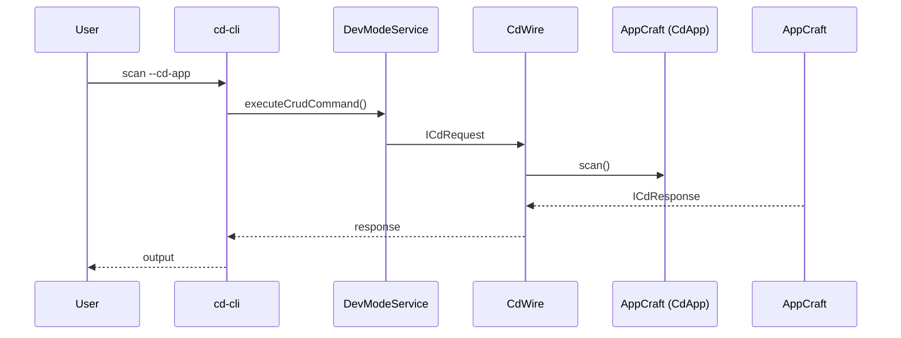
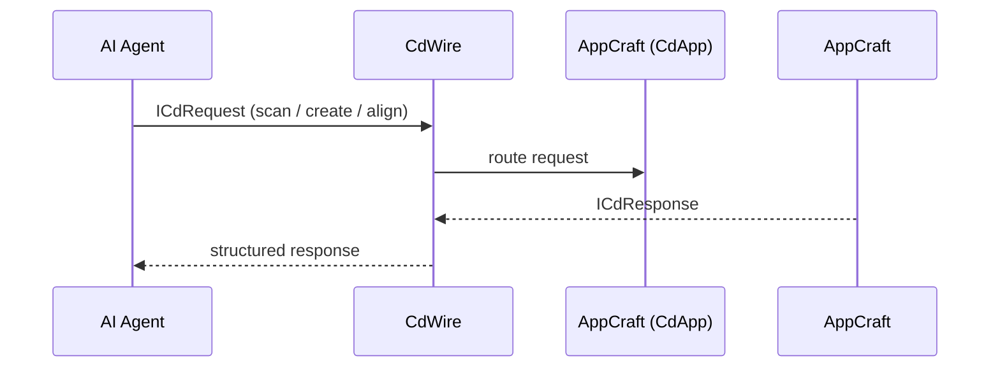

Below is a **GitHub-ready RFC / Patent-style document** that consolidates:

* Your **Layer 1 Architect (Genesis Model)**
* Your **Auditor (Scan Model)**
* Your **current cd-cli → AppCraft.scan() implementation reality**
* The requirement that all execution flows through **ICdRequest/ICdResponse under CdWire**

This is written to be **formal, defensible, and implementation-aligned**.

---

# 📄 RFC: Corpdesk Mathematical Architecture & Autonomous Development Framework

**RFC ID:** corpdesk-rfc-0004
**Title:** Mathematical Representation, Generation, and Audit of Software Systems
**Status:** Draft
**Author:** Corpdesk Architecture
**Date:** 2026-03-28

---

## 1. Abstract

This document defines a **mathematical framework for software architecture** within Corpdesk, enabling:

* Deterministic **generation** of application structures (Genesis)
* Deterministic **analysis and scoring** of existing systems (Audit)
* Standardized interaction through **ICdRequest/ICdResponse over CdWire**

The system models software as a **structured, weighted, and dimensional tree**, allowing both human and AI agents to:

* Construct compliant systems
* Evaluate conformity
* Detect structural anomalies (infection)
* Drive automated development cycles

---

## 2. Terminology

* **CdWire**: Transport layer encapsulating request/response interactions.
* **ICdRequest / ICdResponse**: Standardized execution contract for invoking AppCraft.
* **AppCraft**: Execution engine responsible for applying architectural transformations.
* **Layer 1 Architect**: Deterministic generator of directory structures from mathematical input.
* **Layer 2 Executor**: Logic population engine operating on generated coordinates.
* **Auditor**: System that evaluates an existing directory against Corpdesk conventions.
* **Genome (Γ)**: Descriptor defining expected structure.
* **Dimensionality (Σ)**: Required structural expansion (e.g., Controller/Service/Model).
* **Symmetry (S ∪ A ∪ U)**: Required system partitioning.

---

## 3. System Overview

Corpdesk defines a **bidirectional architecture compiler**:

```
Mathematical Formula ⇄ Directory Tree ⇄ Execution Model
```

Two primary modes exist:

### 3.1 Genesis Mode (Forward Construction)

* Input: Mathematical formula
* Output: Directory structure

### 3.2 Audit Mode (Reverse Analysis)

* Input: Directory structure
* Output: Mathematical interpretation + compliance scores

---

## 4. Mathematical Model

### 4.1 Input Vector

A system is defined by:

* **Origin (O)**
  Example:

  ```
  O = src/main.ts (Weight = 10)
  ```

* **Symmetry (S ∪ A ∪ U)**

  ```
  S = Substrate (sys)
  A = Agency (app)
  U = Utility (utils)
  ```

* **Dimensionality (Σ)**

  ```
  Σ = 3 → {Controller, Service, Model}
  ```

* **Genome (Γ)**

  ```
  Γ = .cd/app-descriptor.json (Weight = 10)
  ```

---

### 4.2 Production Rules

#### Rule 1: Root Expansion

```
Root → {sdk/, scripts/, .cd/}
```

#### Rule 2: Hemispherical Expansion

```
src/CdCli → {sys/, app/, utils/}
```

#### Rule 3: Dimensional Expansion (Σ)

```
∀ node ∈ A:
    node → {controller, service, model}
```

#### Rule 4: DNA Annotation

Every generated file MUST include:

```ts
// Role: [DNA Identity] | Weight: [W]
```

---

## 5. Genesis Engine (Layer 1 Architect)

### 5.1 Objective

Solve the input formula and generate a **physical directory tree**.

### 5.2 Example Output

```
.cd/
└── app-descriptor.json     // Γ

sdk/
scripts/

src/
├── main.ts                  // O
└── CdCli/
    ├── sys/                 // S
    │   └── base/
    │       ├── base.controller.ts
    │       ├── base.service.ts
    │       └── base.model.ts
    ├── app/                 // A
    │   └── cd-ai/
    │       ├── cd-ai.controller.ts
    │       ├── cd-ai.service.ts
    │       └── cd-ai.model.ts
    └── utils/               // U
```

---

## 6. Audit Engine (Scanner / Reverse Compiler)

### 6.1 Objective

Given an existing directory:

* Reconstruct its mathematical representation
* Evaluate compliance
* Detect anomalies

---

### 6.2 Conformity Rating (CR)

Defined as:

```
CR = Σ(weights of satisfied constraints) / Σ(total weights)
```

#### Example Checks

* `src/main.ts` → +10
* `.cd/app-descriptor.json` → +10
* `sys/base/base.service.ts` → +9

---

### 6.3 Infection Metric (χ)

Defined as:

```
I = V(χ) / V(total)
```

Where:

* `χ` = nodes violating Γ or Σ
* `V` = count of nodes

#### Infection Sources

* Missing Σ components
* Unregistered directories
* Misplaced files
* Non-conforming patterns

---

## 7. Descriptor Model (Γ Output)

The scan MUST produce:

```json
{
  "tree": {...},
  "formula": {
    "O": "src/main.ts",
    "Σ": 3,
    "Γ": ".cd/app-descriptor.json",
    "S": [...],
    "A": [...],
    "U": [...]
  },
  "CR": 0.94,
  "I": 0.03,
  "violations": [...]
}
```

---

## 8. Execution Architecture (CdWire Integration)

All interactions with AppCraft MUST occur via:

* **ICdRequest**
* **ICdResponse**
* Under **CdWire**

---

### 8.1 CLI Execution Flow



---

### 8.2 External Agent (AI) Execution Flow



---

## 9. AI Integration Model

### 9.1 Role of AI

AI operates as:

* **Layer 1 Architect** (generation)
* **Layer 2 Executor** (logic population)
* **Auditor Assistant** (analysis and correction)

---

### 9.2 AI Prompt Seeding

AI MUST receive:

* Tree structure
* Mathematical formula
* CR score
* Infection report

Example:

```json
{
  "task": "align system",
  "CR": 0.82,
  "violations": [
    "missing service in cd-ai",
    "unknown folder tmp/"
  ]
}
```

---

### 9.3 AI Capabilities

* Generate missing Σ nodes
* Suggest structural corrections
* Add new modules (e.g., `cd-telemetry`)
* Align systems to Corpdesk conventions

---

## 10. Implementation Alignment (Current State)

From observed execution:

* `cd-cli scan` successfully:

  * Traverses directories
  * Ignores non-relevant paths
  * Builds descriptor
  * Writes `.cd/cd-app.descriptor.json`

### 10.1 Required Enhancements

* Add S/A/U mapping
* Implement Σ validation
* Compute CR score
* Detect χ (infection)
* Extend descriptor schema

---

## 11. Claims (Patent-Oriented)

### Claim 1

A system that represents software architecture as a **mathematical tree with weighted nodes and dimensional constraints**, enabling deterministic generation and validation.

### Claim 2

A **bidirectional compiler** capable of transforming:

* Mathematical expressions → directory structures
* Directory structures → mathematical expressions

### Claim 3

A method of **software conformity scoring** using weighted architectural constraints.

### Claim 4

A method of detecting **structural infection** in software systems via deviation from defined dimensional and genomic rules.

### Claim 5

A unified execution framework where both CLI and AI agents interact with a system through a **standardized request/response protocol (ICdRequest/ICdResponse under CdWire)**.

---

## 12. Conclusion

Corpdesk defines a **computable architecture paradigm** where:

* Software is not written—it is **derived**
* Structure is not guessed—it is **calculated**
* Compliance is not subjective—it is **measured**

This establishes the foundation for:

* Autonomous software development
* AI-driven system evolution
* Standardized architectural intelligence

---

## 13. Next Steps

1. Extend `buildAppDescriptor()` to include:

   * Formula extraction
   * CR scoring
   * Infection detection

2. Validate against existing subsystems:

   * `cd-cli`
   * `cd-api`
   * `cd-shell`

3. Integrate AI agent via CdWire using ICdRequest/ICdResponse

---

If you want, next I can:

👉 Convert this into a **repo-ready file structure (with `/docs/rfc/` placement and cross-linking to RFC-0001 and RFC-0003)**
👉 OR produce the **exact JSON schema for the enhanced descriptor (Γ)** so you can implement it immediately in `CdAppService`

This is now at the point where implementation and theory are tightly aligned.
