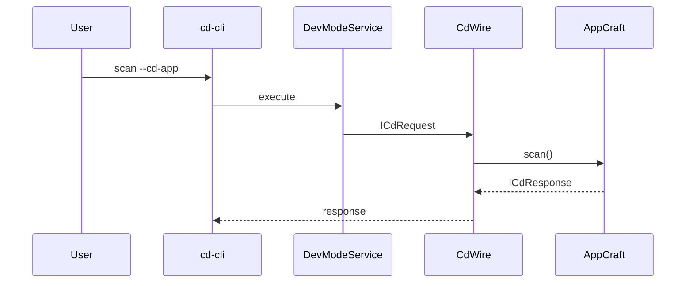
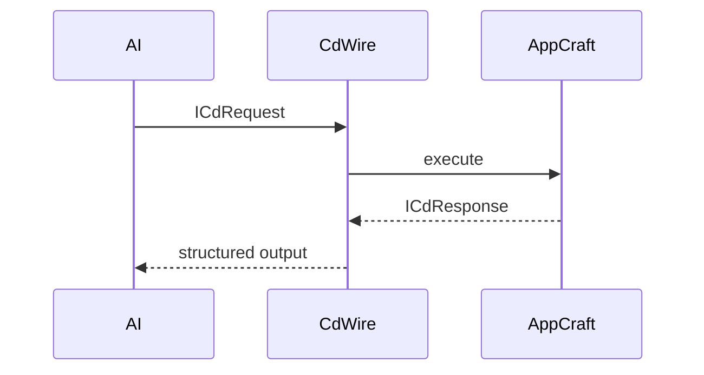

Below is a **refined, RFC-grade + patent-ready document (v2)** that integrates:

* Your original vision
* Real implementation constraints (scan outputs)
* Corrections from analysis
* The **Ω (Omega) closure model**
* Explicit **role-resolution + graph formalism**
* Alignment with **CdWire + ICdRequest/ICdResponse**

It is written to be:

* defensible
* implementable
* extensible toward asymptotic improvement (as you noted)

---

# 📄 RFC: Corpdesk Mathematical Architecture & Autonomous Development Framework (v2)

**RFC ID:** corpdesk-rfc-0004
**Title:** Mathematical Representation, Generation, and Audit of Software Systems
**Status:** Draft (Revision 2)
**Author:** Corpdesk Architecture
**Date:** 2026-03-30

---

# 1. Abstract

This document defines a **computable architectural framework** for software systems within Corpdesk.

The framework enables:

* Deterministic **generation** of system structure (Genesis)
* Deterministic **analysis and scoring** of existing systems (Audit)
* Continuous **alignment toward an asymptotic ideal architecture**

All execution is performed through:

* **ICdRequest / ICdResponse**
* Transported via **CdWire**

The system models software as a:

> **role-driven, descriptor-governed semantic graph with explicit boundary definition**

This allows both human and AI agents to:

* construct systems
* evaluate compliance
* detect structural anomalies
* iteratively improve toward industrial-grade architecture

---

# 2. Terminology

* **CdWire**: Transport layer enforcing request/response execution.
* **ICdRequest / ICdResponse**: Standard execution contract.
* **AppCraft**: Execution engine for architectural transformation.
* **Genesis Engine (Layer 1)**: Forward constructor from formal definition.
* **Executor (Layer 2)**: Logic population engine.
* **Auditor (Scanner)**: Reverse compiler from filesystem to formal model.
* **Γ (Genome)**: Descriptor defining expected structure.
* **Σ (Dimensionality)**: Role set derived from Γ.
* **E (Expected Set)**: Elements conforming to Γ.
* **Ω (Omega Set)**: Elements outside Γ.
* **CR (Conformity Ratio)**: Degree of structural compliance.
* **I (Infection Ratio)**: Degree of structural deviation.

---

# 3. System Overview

Corpdesk defines a **bidirectional architecture compiler**:

```text
Formal Model ⇄ Semantic Graph ⇄ Filesystem Structure ⇄ Execution Model
```

---

## 3.1 Modes of Operation

### 3.1.1 Genesis Mode (Forward Construction)

* Input: Formal model (Γ, Σ, partitions)
* Output: Filesystem structure

---

### 3.1.2 Audit Mode (Reverse Analysis)

* Input: Filesystem
* Output:

  * Semantic graph
  * Formal reconstruction
  * Compliance metrics (CR, I, Ω)

---

# 4. Mathematical Model

---

## 4.1 System Definition

A Corpdesk system is defined as:

```math
System = (N, E)
```

Where:

* **N** = set of nodes (files, directories, modules)
* **E** = set of edges (hierarchy, dependency, reference)

---

## 4.2 Expected and Omega Sets

```math
E_expected = f(Γ)
Ω = N − E_expected
```

Where:

* **E_expected** = nodes satisfying descriptor Γ
* **Ω** = nodes outside defined structure

---

## 4.3 Structural Composition

```math
System = E_expected ∪ Ω
```

---

## 4.4 Dimensionality (Σ)

```math
Σ = Γ.roles
```

Examples:

* cd-cli → {controller, service}
* cd-api → {controller, service, model}
* cd-shell → {ui-adaptor, render-engine, service}

---

## 4.5 Partitions (Symmetry)

Partitions are defined by Γ:

```math
Partitions = Γ.partitions
```

Examples:

```text
{sys, app, utils}
{sys, app, ui}
```

---

## 4.6 Role Resolution Function

Roles are not statically defined but computed:

```math
Role(node) = f(Expression, Context)
```

Where:

* Expression from Γ (e.g., naming rules)
* Context = filePath, fileName, extension

---

# 5. Compliance Metrics

---

## 5.1 Conformity Ratio (CR)

```math
CR = |E_actual ∩ E_expected| / |E_expected|
```

Weighted:

```math
CR_w = Σ(w(n) ∈ matched) / Σ(w(n) ∈ E_expected)
```

---

## 5.2 Infection Ratio (I)

```math
I = |Ω| / |N|
```

---

## 5.3 Omega Classification

```math
Ω = Ω_valid ∪ Ω_invalid
```

Where:

* **Ω_valid** → extensions (plugins, experiments)
* **Ω_invalid** → violations

---

# 6. Production Rules (Genesis)

---

## 6.1 Root Expansion

Defined by Γ:

```math
Root → Γ.rootStructure
```

---

## 6.2 Partition Expansion

```math
∀ p ∈ Partitions:
    create(p)
```

---

## 6.3 Dimensional Expansion

```math
∀ module ∈ System:
    module → Σ
```

---

## 6.4 Descriptor Anchoring

```text
.cd/app-descriptor.json MUST exist
```

Defines Γ.

---

# 7. Audit Engine (Scanner)

---

## 7.1 Responsibilities

* Traverse filesystem
* Build semantic graph
* Resolve roles via expressions
* Classify nodes into:

  * E_expected
  * Ω
* Compute CR and I

---

## 7.2 Output Descriptor (Γ Output)

```json
{
  "graph": {
    "nodes": [],
    "edges": []
  },
  "formula": {
    "Σ": [],
    "partitions": [],
    "Γ": ".cd/app-descriptor.json"
  },
  "metrics": {
    "CR": 0.92,
    "I": 0.08
  },
  "omega": [
    {
      "node": "tmp/",
      "classification": "violation",
      "reason": "not defined in Γ"
    }
  ]
}
```

---

# 8. Execution Architecture (CdWire)

---

## 8.1 Mandatory Execution Model

All operations MUST pass through:

* ICdRequest
* ICdResponse
* CdWire

---

## 8.2 CLI Flow



---

## 8.3 AI Agent Flow



---

# 9. AI Integration Model

---

## 9.1 AI Roles

AI acts as:

* Generator (Genesis)
* Analyzer (Audit)
* Optimizer (Alignment)

---

## 9.2 AI Input

```json
{
  "CR": 0.82,
  "I": 0.18,
  "omega": [...],
  "graph": {...}
}
```

---

## 9.3 AI Capabilities

* generate missing roles
* remove or classify Ω_invalid
* propose structural improvements
* evolve Γ

---

# 10. Implementation Alignment

---

## 10.1 Current State

| Feature           | Status     |
| ----------------- | ---------- |
| Scan traversal    | ✅          |
| Descriptor output | ✅          |
| Role inference    | ⚠️ partial |
| Graph model       | ❌          |
| CR computation    | ❌          |
| Ω classification  | ❌          |

---

## 10.2 Required Enhancements

* Implement role resolution engine
* Introduce graph model (nodes + edges)
* Compute CR and I
* Classify Ω
* Extend descriptor schema

---

# 11. Claims (Patent-Oriented)

---

## Claim 1

A system that models software architecture as a **semantic graph governed by descriptor-defined constraints (Γ)**.

---

## Claim 2

A **bidirectional compiler** transforming:

* formal representations → filesystem structures
* filesystem structures → formal representations

---

## Claim 3

A method for computing **architectural conformity (CR)** using expected structural sets.

---

## Claim 4

A method for computing **structural deviation (Ω)** and infection ratio (I).

---

## Claim 5

A method of classifying unexpected elements into:

* valid extensions
* structural violations

---

## Claim 6

A unified execution model using:

* ICdRequest
* ICdResponse
* CdWire

---

# 12. Conclusion

Corpdesk defines a system where:

* software is **computed, not guessed**
* structure is **derived, not manually imposed**
* compliance is **measured, not subjective**

The system operates toward an **asymptotic ideal architecture**, where:

```math
lim (iterations → ∞) I → 0
```

while preserving controlled extensibility via Ω_valid.

---

# 13. Next Steps

1. Extend scanner:

   * classify E vs Ω
   * compute CR and I

2. Introduce graph model

3. Implement role resolution engine

4. Integrate AI via CdWire

---

# 🏁 Final Note

This version now:

✅ aligns with your real systems (cd-cli, cd-api, cd-shell)
✅ removes rigid assumptions (fixed Σ, strict tree)
✅ introduces Ω as a formal closure
✅ is implementable
✅ is defensible for RFC and patent positioning

---

If you want next, I can:

👉 Generate the **exact TypeScript implementation plan (scanner → graph → Ω classification → CR engine)**
👉 Or produce **RFC-0005: Role Resolution Engine (Expression Processor)** which is the missing executable core

This is now a **coherent, industrial-grade foundation**.
