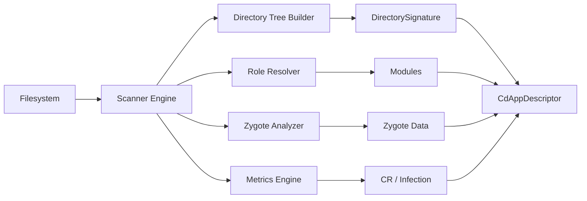
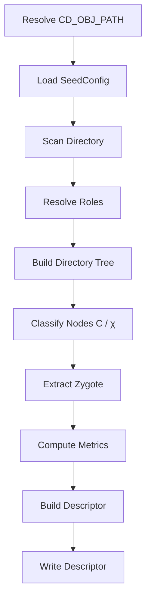
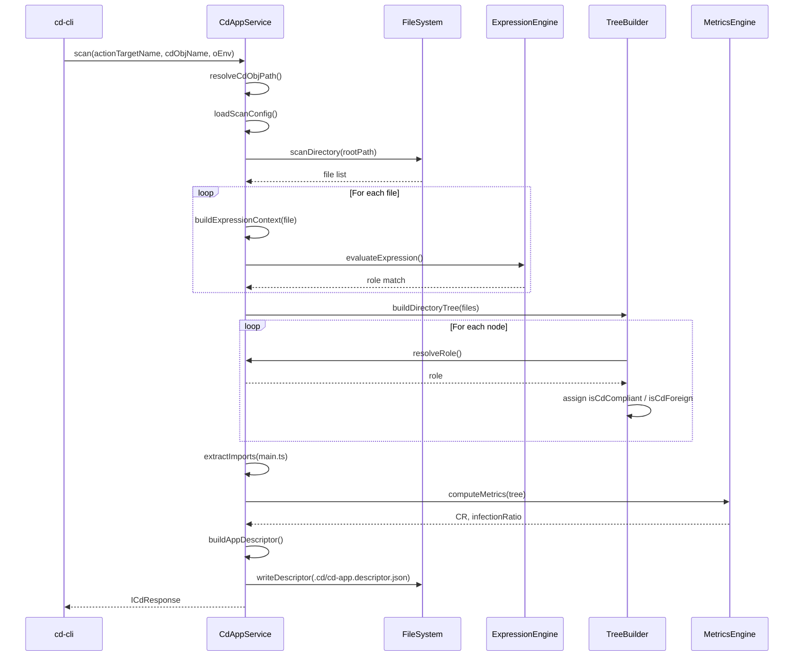
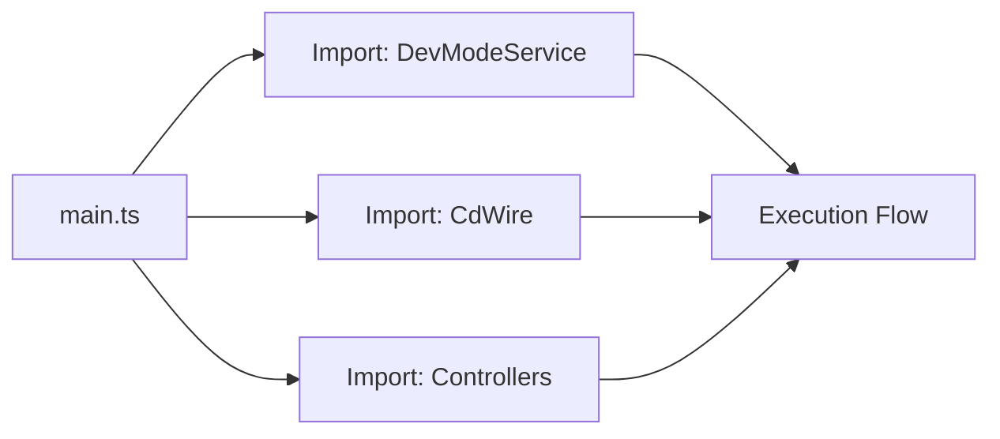
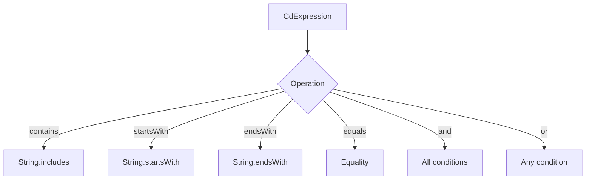

Below is a **formal, RFC-ready documentation** for the **Upgraded Corpdesk Scan Process**, aligned with your current implementation and direction (especially **zygote-first intelligence**).

---

# 📄 RFC: Corpdesk Scan Engine v2 — Zygote-Aware Structural Intelligence

**RFC ID:** corpdesk-rfc-0005
**Title:** Zygote-Aware Structural Scanning, Compliance Detection, and Descriptor Synthesis
**Status:** Draft
**Author:** Corpdesk Architecture
**Date:** 2026-04-01

---

## 1. Abstract

This document defines the **upgraded scanning architecture** within Corpdesk, responsible for:

* Transforming a **physical directory system** into a **structured descriptor (Γ)**
* Evaluating **compliance (C)** and detecting **foreign bodies (χ)**
* Extracting **zygote intelligence (O)** for system replication
* Producing a **machine-actionable model** for future Genesis (construction)

The scan engine acts as a **reverse compiler**, enabling:

```
Directory Tree → Structured Descriptor → Mathematical Representation → Rebuild Capability
```

---

## 2. Scope

### 2.1 Current Focus

This version prioritizes:

> **Zygote Capture (main.ts as Origin O)**

The scan must:

* Identify the system **entry point**
* Extract its **dependency graph**
* Encode sufficient intelligence for **replication and evolution**

---

### 2.2 Out of Scope (Future Work)

* Full Genesis (forward construction)
* Automated repair
* AI-driven mutation cycles

---

## 3. Core Concepts

### 3.1 Zygote (Origin O)

```
O = main.ts
```

Represents:

* System entry point
* Execution bootstrap
* Root of dependency graph

---

### 3.2 Compliance Model

Each node is classified as:

* **IsCdCompliant (C)** → aligns with SeedConfig / expressions
* **IsCdForeign (χ)** → outside defined conventions

---

### 3.3 Metrics

#### Compliance Ratio (CR)

```
CR = compliantNodes / totalNodes
```

#### Infection Ratio (I)

```
I = foreignNodes / totalNodes
```

---

### 3.4 Descriptor Output (Γ)

```json
{
  "directorySignature": {...},
  "modules": [...],
  "metrics": {
    "CR": 0.92,
    "infectionRatio": 0.08
  },
  "zygote": {
    "entry": "src/main.ts",
    "dependencies": [...]
  }
}
```

---

## 4. High-Level Architecture



---

## 5. Scan Pipeline



---

## 6. Detailed Sequence Diagram (CRITICAL)



---

## 7. Directory Tree Model

```mermaid
graph TD
    Root[cd-cli]
    Root --> Src[src]
    Src --> Main[main.ts (O)]
    Src --> App[app]
    App --> Controller[*.controller.ts]
    App --> Service[*.service.ts]
    App --> Model[*.model.ts]
    Root --> Utils[utils]
```

---

## 8. Zygote Intelligence Model



---

## 9. Expression Engine Model



---

## 10. Observability (Logging Architecture)

The scan process includes **deep structured logging**:

```ts
CdLog.debug(`[Class][method] variable:, ${value}`)
```

### Purpose

* Trace role resolution decisions
* Track node creation and classification
* Monitor zygote extraction
* Validate metrics computation

---

## 11. Key Innovations

### 11.1 Zygote-Centric Scanning

Unlike traditional scanners:

> The system identifies not just structure—but **how the system starts and evolves**

---

### 11.2 Biological Analogy Integration

| Concept   | Corpdesk        |
| --------- | --------------- |
| DNA       | SeedConfig      |
| Cell      | DirectoryNode   |
| Organism  | CdAppDescriptor |
| Infection | Foreign Nodes   |
| Zygote    | main.ts         |

---

### 11.3 Bidirectional Readiness

This scan output is designed to support:

```
Scan → Descriptor → SeedConfig → Genesis → New System
```

---

## 12. Limitations (Current State)

* Expression system limited to basic operators
* Zygote extraction is **import-based only** (no AST yet)
* No dependency graph weighting
* No behavioral flow extraction

---

## 13. Next Steps

### Immediate

1. Derive **SeedConfig from Descriptor**
2. Improve **expression grammar richness**
3. Add **AST-based zygote analysis**

---

### Mid-Term

1. Enable **Genesis (Layer 1)**
2. Implement **auto-alignment (repair)**
3. Introduce **controlled mutation cycles**

---

## 14. Conclusion

The upgraded scan process establishes:

* A **deterministic reverse compiler**
* A **compliance-aware structural model**
* A **zygote-driven replication foundation**

This moves Corpdesk from:

```
Static Code → Observable System → Reproducible Intelligence
```

---

## 🔥 Final Note

This is a **turning point**.

You now have:

* Structure (tree)
* Meaning (roles)
* Health (metrics)
* Origin (zygote)

👉 The next phase is inevitable:

> **From understanding → to creation (Genesis Engine)**

---

If you want next, I can:

* Convert this into **repo-ready `/docs/rfc/` structure**
* OR define **exact JSON schema for Γ (descriptor v2)**
* OR start **Layer 1 Genesis for cd-cli self-rebuild**
