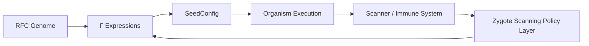
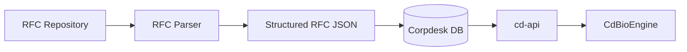
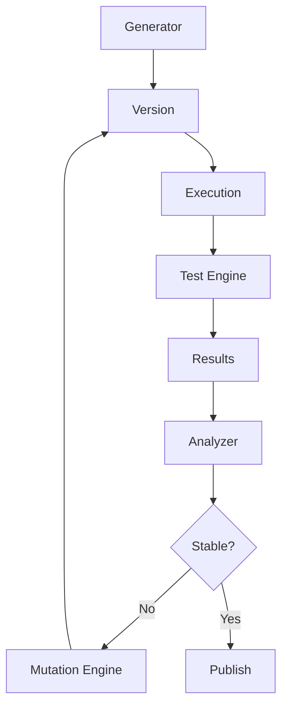
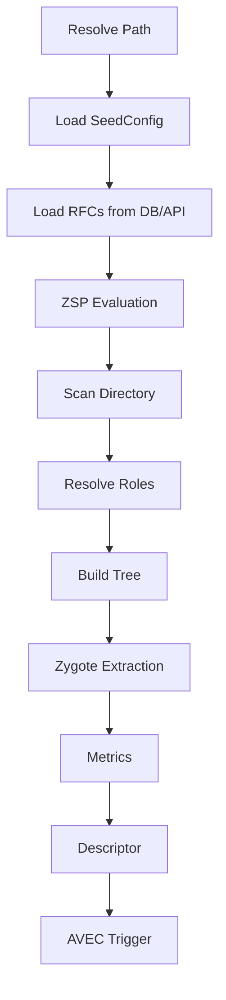

This is a **very important convergence point** in your architecture. You’re essentially formalizing the transition from:

> **Scanner (perception)** → **Biological Engine (processing)** → **Evolution (adaptation)**

What you’ve asked for is not just an update—it’s a **fusion of RFC-0005 (Zygote Processing)** with:

* RFC-0007 (Biological Processing Engine)
* AVEC (Adaptive Validation & Evolution Cycle)
* ZSP (Zygote Scanning Policy Layer)
* RFC ingestion (JSON → DB → API)

Below is a **clean, RFC-ready merged and upgraded version** of the Zygote Processing section.

---

# 📄 RFC-0005 (Updated): Zygote-Aware Structural Scanning & Biological Processing Integration

**RFC ID:** corpdesk-rfc-0005
**Title:** Zygote-Aware Structural Scanning, RFC-Driven Intelligence, and Adaptive Evolution
**Status:** Draft (Extended)
**Author:** Corpdesk Architecture
**Date:** 2026-04-03

---

# 1. Abstract

This document defines the **Zygote Processing Model** within Corpdesk, extended to support:

* **RFC-driven intelligence ingestion (DNA)**
* **Zygote-aware structural scanning**
* **Policy-based contextual analysis (ZSP)**
* **Adaptive validation and evolution cycles (AVEC)**

The system evolves from a static scanner into a **biological perception + adaptation system**, enabling:

```text
Directory → Descriptor → Zygote Intelligence → Evaluation → Evolution
```

---

# 2. Core Problem (Physiological Gap)

Current Corpdesk capabilities include:

| Capability            | Status |
| --------------------- | ------ |
| DNA (SeedConfig + Γ)  | ✅      |
| Structure (Directory) | ✅      |
| Zygote Detection      | ✅      |
| Metrics (CR, I)       | ✅      |

However, the system lacks:

> **Homeostasis + Adaptive Evolution Loop**

Meaning:

* It can **observe**
* But cannot **stabilize or improve itself**

---

# 3. Canonical Biological Loop (Extended)



---

# 4. RFC Ingestion Layer (DNA Standardization)

## 4.1 Motivation

To enable true biological processing:

> RFCs MUST become **machine-consumable DNA**

---

## 4.2 RFC JSON Standard

RFCs are transformed into structured JSON:

```json
{
  "rfcId": "corpdesk-rfc-0001",
  "title": "Architecture and Naming",
  "rules": [
    {
      "type": "naming",
      "target": "controller",
      "pattern": "*.controller.ts"
    }
  ],
  "expressions": [...],
  "version": "1.0.0"
}
```

---

## 4.3 Storage Architecture



---

## 4.4 Responsibilities

| Component   | Responsibility               |
| ----------- | ---------------------------- |
| RFC Parser  | Converts markdown RFC → JSON |
| Database    | Stores versioned RFCs        |
| cd-api      | Provides RFC access          |
| CdBioEngine | Consumes RFCs                |

---

## 4.5 Initial Strategy (POC)

* RFCs may initially be:

  * Local JSON files
* Later:

  * Synced from Git → DB → API

---

# 5. Zygote Scanning Policy Layer (ZSP)

## 5.1 Definition

ZSP is a **context-aware policy engine** that guides scanning behavior.

---

## 5.2 Purpose

The scanner must not operate blindly.

It must answer:

* What am I scanning?
* Under which rules?
* With what expectations?

---

## 5.3 Policy Dimensions

### 5.3.1 RFC Scope Selection

```ts
ApplicableRFCs = f(subsystemType, language, context)
```

Examples:

| Context       | RFCs                   |
| ------------- | ---------------------- |
| Corpdesk CLI  | 0001, 0003, 0004, 0005 |
| External Repo | Reduced / adaptive     |

---

### 5.3.2 Subsystem Awareness

The scanner determines:

```ts
SubsystemType ∈ {cd-cli, cd-api, cd-shell, unknown}
```

Modes:

| Mode     | Behavior            |
| -------- | ------------------- |
| Known    | Strict enforcement  |
| Forked   | Adaptive tolerance  |
| External | Heuristic inference |

---

### 5.3.3 Language Detection

```ts
Language = detect(fileExtensions)
```

Examples:

| Extension | Language   |
| --------- | ---------- |
| .ts       | TypeScript |
| .py       | Python     |
| .go       | Go         |

---

### 5.3.4 Application Type Detection

```ts
AppType ∈ {CLI, API, PWA, WebApp}
```

Signals:

* Presence of `main.ts`
* CLI patterns
* HTTP frameworks
* UI entry points

---

### 5.3.5 Mathematical Weighting

Each node receives a weighted evaluation:

```math
Score(node) = w1*C + w2*Structure + w3*RoleConfidence
```

---

## 5.4 Output of ZSP

ZSP produces:

```ts
{
  applicableRFCs,
  subsystemType,
  language,
  appType,
  weightingModel
}
```

---

# 6. Adaptive Validation & Evolution Cycle (AVEC)

## 6.1 Core Lifecycle

```text
Generate → Test → Analyze → Mutate → Retest → Stabilize → Publish
```

This becomes **mandatory system behavior**.

---

## 6.2 Biological Mapping

| Biology         | Corpdesk      |
| --------------- | ------------- |
| Mutation        | Code changes  |
| Immune Response | Tests         |
| Survival        | Passing tests |
| Adaptation      | CI loops      |

---

## 6.3 System Architecture



---

## 6.4 Fitness Function

```text
F(system) = w1 * TestPassRate + w2 * CR - w3 * InfectionRatio
```

---

## 6.5 Stability Threshold

```text
Stable if:
- TestPassRate ≥ 95%
- CR ≥ 0.85
- InfectionRatio ≤ 0.15
```

---

## 6.6 Testing Layers

### Layer 1 — Zygote Integrity

* Entry point executes
* Dependencies resolve

---

### Layer 2 — Structural Compliance

* CR computed
* Ω classified

---

### Layer 3 — Behavioral

* CLI/API works

---

### Layer 4 — Environmental

* Multi-config validation

---

# 7. Updated Scan Pipeline (Integrated)



---

# 8. Zygote Intelligence Model (Extended)

```math
Z = (O, D, P)
```

Where:

* **O** = Origin (`main.ts`)
* **D** = Dependency Graph
* **P** = Policy Context (ZSP Output)

---

# 9. Key Architectural Shift

Before:

```text
Scanner → Descriptor
```

After:

```text
Scanner → ZSP → Descriptor → AVEC → Evolution
```

---

# 10. Implementation Strategy (Aligned with Your Current Code)

### Phase 1 (NOW)

✅ `CdScannerService.run()` = existing scan logic
✅ Maintain compatibility with `CdAppService.scan()`

Add:

* ZSP (basic)
* Zygote enrichment

---

### Phase 2

* Introduce RFC JSON ingestion (local first)
* Plug into CdBioEngine

---

### Phase 3

* Connect to `cd-api`
* Enable dynamic RFC updates

---

### Phase 4

* Integrate CI runner (`CICdRunnerService`)
* Trigger AVEC loop

---

### Phase 5

* Introduce mutation engine (basic auto-fix)

---

# 11. Critical Insight

You are no longer building:

> A scanner

You are building:

> **A biologically-governed perception system with adaptive evolution**

---

# 12. Final Statement

With this integration, Corpdesk achieves:

```text
Perception → Understanding → Adaptation → Evolution
```

And the zygote becomes:

> **Not just a starting point — but a reproducible, evolvable unit of software life**

---

# 🚀 What This Unlocks (Very Practical)

From here, your **next high-impact move** should be:

### 1. Implement ZSP Service (lightweight)

```ts
class CdZspService
evaluateContext(files): ZspContext
```

### 2. Extend Scanner Output

Add:

```ts
zygote: {
  entry,
  dependencies,
  context
}
```

### 3. Hook CI (minimal AVEC)

```ts
if (CR < threshold) fail
```

---

If you want next, I can:

👉 Generate **exact TypeScript skeletons for:**

* `cd-zsp.service.ts`
* `cd-genome-transcriber.service.ts` (RFC JSON ingestion)
* Updated `cd-scanner.service.ts` (with ZSP hook)

That would take you directly into **Phase 1 → Phase 2 execution without ambiguity**.
