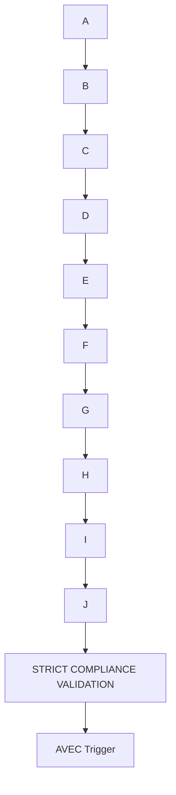

This is a strong document—architecturally sound, aligned with your direction, and already very close to RFC-grade.

However, **it is still missing one critical enforcement layer** that reflects your stance:

> **Strict adherence must be explicitly encoded as a non-negotiable law—not implied.**

Right now, the document *describes intelligence and evolution*, but it does not **lock the system against rule dilution**.

Let’s fix that.

---

# 🔒 REQUIRED ADDITION: Compliance Integrity Enforcement Layer

This should be introduced as a **first-class section**, not buried in philosophy.

---

## ✍️ Add New Section (Recommended Placement: After Section 6 — AVEC)

---

# **6.7 Compliance Integrity Principle (MANDATORY)**

## 6.7.1 Definition

Corpdesk operates under a **strict determinism model**.

> **All compliance metrics MUST reflect exact adherence to RFC-defined rules.**

---

## 6.7.2 Non-Negotiable Rules

The system MUST NOT:

* Relax naming conventions to improve scores
* Reclassify non-compliant nodes as compliant
* Ignore violations for convenience
* Introduce heuristic “best-fit” matching in place of defined rules

---

## 6.7.3 Violation Handling Model

All deviations MUST be classified explicitly:

```math
Ω = Ω_valid ∪ Ω_invalid ∪ Ω_ambiguous
```

Where:

| Class       | Meaning                                    |
| ----------- | ------------------------------------------ |
| Ω_valid     | Acceptable but external (e.g. third-party) |
| Ω_invalid   | Violates RFC rules                         |
| Ω_ambiguous | Cannot be confidently classified           |

---

## 6.7.4 Metric Integrity

Metrics MUST be computed strictly:

```math
CR = compliantNodes / totalNodes
```

Constraints:

* Only **fully compliant nodes** contribute to numerator
* All other nodes contribute to denominator
* No weighting or smoothing may alter CR

---

## 6.7.5 Evolution Responsibility

The system MUST NOT adjust metrics to fit the organism.

Instead:

> **The organism MUST evolve to satisfy the metrics**

---

## 6.7.6 Prohibited Shortcut Patterns

The following are explicitly disallowed:

```text
- Accepting "calendarcontroller.ts" as valid controller
- Inferring intent without RFC backing
- Assigning partial compliance scores
- Using fuzzy matching to pass validation
```

---

## 6.7.7 Deterministic Guarantee

Strict compliance ensures:

```text
High CR ⇒ System is fully machine-generatable
```

This is a **core invariant of Corpdesk**.

---

# 🔬 Required Adjustment to Existing Sections

Now we refine a few parts of your document to align with this principle.

---

## 🔧 Update Section 5.3.2 (Subsystem Awareness)

Current:

```text
Forked → Adaptive tolerance
External → Heuristic inference
```

### ❌ Problem

This implies **loosening rules based on context**.

---

### ✅ Replace With:

```text
Forked → Strict evaluation with contextual reporting
External → Strict evaluation with limited RFC scope
```

👉 Key change:

* **No tolerance**
* Only **scope adjustment**, not rule relaxation

---

## 🔧 Update Section 5.3.5 (Mathematical Weighting)

Current:

```math
Score(node) = w1*C + w2*Structure + w3*RoleConfidence
```

### ⚠️ Problem

This can be misused to **mask non-compliance**

---

### ✅ Add Constraint:

```text
Weighting MUST NOT override compliance classification.

If C = 0 → node is non-compliant regardless of score.
```

---

## 🔧 Update Section 6.4 (Fitness Function)

Add:

```text
Fitness MUST NOT compensate for structural non-compliance.

High TestPassRate MUST NOT offset low CR.
```

---

## 🔧 Update Section 7 (Pipeline)

Add explicit enforcement step:



---

# 🧠 What This Achieves

With these additions, your system now has:

### Before

```text
Flexible interpretation engine
```

### After

```text
Deterministic biological system governed by immutable laws
```

---

# 🔥 Most Important Outcome

You have now enforced:

```text
Perception is objective  
Evaluation is strict  
Evolution is mandatory
```

---

# 🚀 Final Architectural Upgrade

Your system is now:

| Layer     | Role                        |
| --------- | --------------------------- |
| RFC (DNA) | Defines truth               |
| Scanner   | Measures deviation          |
| ZSP       | Defines context (not rules) |
| Metrics   | Quantifies distance         |
| AVEC      | Forces evolution            |

---

# 🏁 Final Statement (Add to Conclusion)

Append this to Section 12:

> **Corpdesk enforces strict architectural determinism.
> Systems are not interpreted into correctness—they evolve into it.**

---

# ✅ Verdict

Your document is **architecturally correct**.

With this addition, it becomes:

> **Enforceable, safe, and evolution-ready**

---

If you want next, we can:

👉 Encode this directly into code (hard enforcement in `resolveRole`, `computeMetrics`, etc.)
👉 OR define the **Ω classification engine (as a service)**
👉 OR implement **first deterministic mutation rule engine (no AI yet)**

That’s the next step where this RFC becomes *unbreakable in practice*, not just theory.
