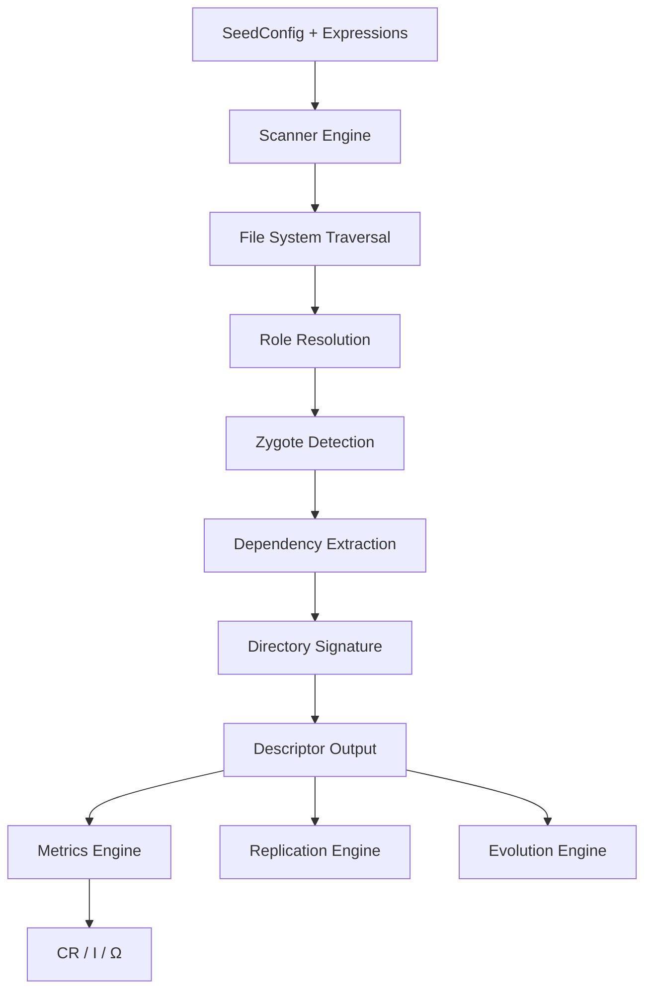
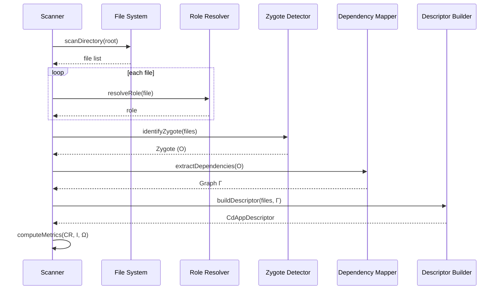
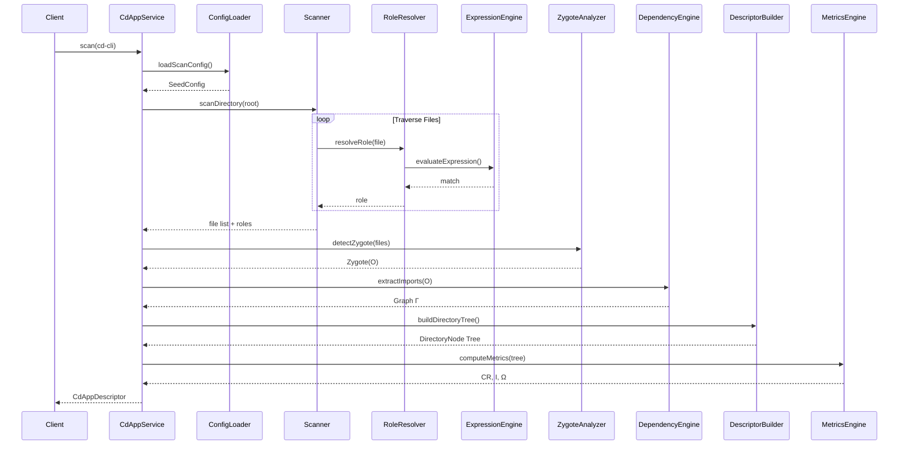
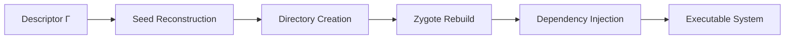
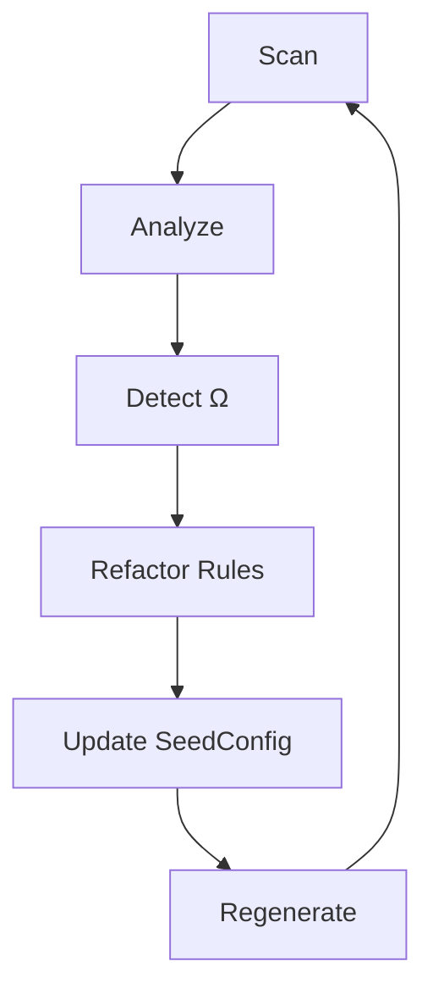

Below is a **refined, RFC-grade draft** that elevates your current work into a formal, enforceable specification while aligning tightly with your principles of **DNA-constrained autonomy**, **zygote primacy**, and **recursive system evolution**.

---

# **RFC-0005: Zygote Capture & Execution Model (ZCEM)**

**Status:** Draft
**Author:** Corpdesk Architecture System
**Date:** 2026-04-01
**Scope:** cd-cli, cd-api, cd-shell (initial focus: `cd-cli`)

---

## **1. Abstract**

This document defines the **Zygote Capture & Execution Model (ZCEM)**—a formal system for identifying, extracting, encoding, and reproducing the **originating execution state** (“Zygote”) of a Corpdesk subsystem.

The Zygote is treated as the **minimal viable life-form** of a system:

> A deterministic, reproducible execution entry point with fully traceable dependency lineage.

ZCEM enables:

* System **self-replication (Genesis)**
* Controlled **evolution cycles**
* Machine-assisted **repair and optimization**
* Strict adherence to **Corpdesk DNA conventions**

---

## **2. Core Principles**

### **2.1 DNA-Constrained Autonomy**

The system:

* MUST operate within defined **SeedConfig + Expression constraints**
* MUST NOT mutate beyond allowed grammar
* MAY evolve only via **controlled refinement cycles**

---

### **2.2 Zygote Primacy**

The **Zygote (O)** is:

* The **first executable unit**
* The **anchor of all dependency graphs**
* The **reference point for replication**

---

### **2.3 Structural Biology Analogy**

| Concept   | Corpdesk Mapping                |
| --------- | ------------------------------- |
| DNA       | SeedConfig + Expressions        |
| Cell      | DirectoryNode                   |
| Organ     | Module                          |
| Organism  | Subsystem (cd-cli, cd-api)      |
| Zygote    | `main.ts` (or equivalent entry) |
| Infection | Non-compliant node              |
| Evolution | Iterative refinement cycles     |

---

## **3. Definitions**

### **3.1 Zygote (O)**

A file node satisfying:

* Entry-point semantics
* Highest execution weight
* Root of dependency graph

```ts
O ∈ Nodes such that:
weight(O) = MAX
AND isEntryPoint(O) = true
```

---

### **3.2 Dependency Graph (Γ)**

A directed graph:

```
Γ = (V, E)
V = Files
E = Import relationships
```

---

### **3.3 Compliance Metrics**

* **Compliance Ratio (CR)**

```
CR = |CdCompliantNodes| / |TotalNodes|
```

* **Infection Ratio (I)**

```
I = |CdForeignNodes| / |TotalNodes|
```

---

### **3.4 Collection Variance Symbol (Ω)**

As per your principle:

> Every expected set MUST include a representation of external/unexpected members.

```
Ω = Set of CdForeign nodes
```

Used for:

* Compliance scoring
* Evolution targeting
* Repair prioritization

---

## **4. System Architecture**



---

## **5. Zygote Capture Pipeline**

### **5.1 High-Level Flow**



---

## **6. Detailed Sequence Diagram (Critical)**



---

## **7. Zygote Identification Rules**

A node is classified as Zygote if:

### **7.1 Expression-Based**

```ts
{
  op: "and",
  conditions: [
    { op: "equals", field: "fileName", value: "main.ts" },
    { op: "contains", field: "filePath", value: "/src/" }
  ]
}
```

---

### **7.2 Weight-Based Override**

* Assign:

```
weight(main.ts) = 10
```

---

### **7.3 Dependency Density Heuristic**

Zygote must:

* Import ≥ N critical modules
* Initialize system services

---

## **8. Dependency Capture Model**

### **8.1 Extraction**

From Zygote:

```
import X from '...'
```

Build:

```
O → X₁, X₂, X₃ ...
```

---

### **8.2 Recursive Expansion**

```
Γ(O) = closure(import graph)
```

---

### **8.3 Partition Enforcement**

* `sys/` → system layer
* `app/` → application layer

Cross-boundary violations:

```
→ flagged as CdForeign
```

---

## **9. Compliance & Infection Model**

### **9.1 Node Classification**

| Property      | Meaning              |
| ------------- | -------------------- |
| isCdCompliant | Matches SeedConfig   |
| isCdForeign   | Violates conventions |
| Ω membership  | Outside expected set |

---

### **9.2 Infection Sources**

* Naming violations
* Directory misalignment
* Unrecognized extensions
* Non-executable artifacts

---

### **9.3 Omega Policy (Ω Handling)**

Ω nodes:

* MUST be tracked
* MUST NOT be ignored
* MAY be tolerated if:

  * Marked `omegaValid: true`

---

## **10. Descriptor Output Requirements**

The output MUST include:

### **10.1 Zygote Metadata**

```ts
zygote: {
  path: string;
  dependencies: string[];
  weight: number;
}
```

---

### **10.2 Dependency Graph**

```ts
dependencyGraph: {
  nodes: string[];
  edges: [string, string][];
}
```

---

### **10.3 Metrics**

```ts
metrics: {
  CR: number;
  infectionRatio: number;
  omegaCount: number;
}
```

---

## **11. Replication (Genesis) Capability**

From descriptor:



---

## **12. Evolution Loop**



---

## **13. Current Scope: Zygote-Centric Scanning**

This phase focuses on:

### **13.1 Priority Targets**

* Accurate Zygote detection (`main.ts`)
* Dependency graph extraction
* Weight prioritization

---

### **13.2 Known Limitations**

* Incomplete SeedConfig coverage
* High Ω (foreign) ratio (~48%)
* Naming convention drift

---

### **13.3 Strategic Insight**

> Zygote capture is **functionally correct**,
> but **DNA (SeedConfig)** is lagging behind system evolution.

---

## **14. Immediate Next Steps**

### **Phase 1 (Now)**

* Stabilize Zygote detection
* Improve expression coverage
* Reduce false Ω classification

---

### **Phase 2**

* Encode dependency graph into SeedConfig
* Introduce bootstrap sequencing model

---

### **Phase 3**

* Enable full subsystem regeneration (cd-cli POC)

---

### **Phase 4**

* Controlled evolution cycles
* Automated repair loops

---

## **15. Conclusion**

ZCEM establishes the **foundation of synthetic software life** within Corpdesk:

* The system **knows how it starts**
* The system **knows what it depends on**
* The system **knows what is foreign**
* The system **can reproduce itself within constraints**

This is the transition from:

> Static codebases → **Living, governed systems**

---

If you want, next we can:

👉 Convert this RFC directly into:

* **Concrete TypeScript interfaces (ZygoteDescriptor, DependencyGraph)**
* OR
* **Exact upgrades to your scanner methods to fully comply with RFC-0005**

Both are the natural next step toward **cd-cli self-generation POC**.
