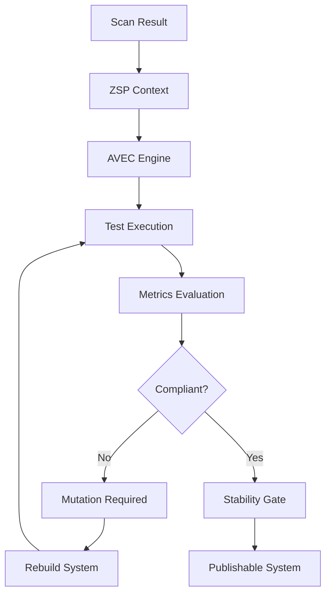

You’ve reached the exact point where the architecture either **stays descriptive** or becomes **deterministic and enforceable**.

What you’re asking for here is critical:
👉 *AVEC must stop being a conceptual extension and become a **strict architectural contract***.

Below is the **formalized, policy-hardened version** of AVEC, aligned with your stance:

> ❗ **No rule relaxation. No score inflation. Only strict adherence and enforced evolution.**

---

# 📄 RFC-0006 (Formalized): Adaptive Validation & Evolution Engine (AVEC)

**RFC ID:** corpdesk-rfc-0006
**Title:** Deterministic Adaptive Validation & Evolution Engine
**Status:** Draft (Strict Enforcement)
**Author:** Corpdesk Architecture
**Date:** 2026-04-04

---

# 1. Abstract

This document defines the **Adaptive Validation & Evolution Engine (AVEC)** as a **mandatory enforcement layer** within Corpdesk.

AVEC transforms the system from:

```text
Passive Observation → Active Enforcement → Deterministic Evolution
```

It ensures that:

> **Only systems that strictly conform to RFC-defined laws are allowed to stabilize and evolve**

---

# 2. Foundational Principle (Non-Negotiable)

## 2.1 Strict Adherence Doctrine

```text
RFCs are LAW, not guidelines
```

Implications:

* ❌ No soft scoring adjustments

* ❌ No tolerance for naming deviations

* ❌ No “contextual forgiveness”

* ✅ Every deviation = measurable defect

* ✅ Every defect contributes to CR degradation

* ✅ Every degradation MUST trigger evolution

---

## 2.2 Interpretation of Metrics

Your insight is now formalized as policy:

| Metric             | Meaning                           |
| ------------------ | --------------------------------- |
| Low CR             | Structural misalignment           |
| High Infection (Ω) | Architectural violation           |
| Combined Result    | System is **unfit for evolution** |

---

## 3. Core Lifecycle Contract (MANDATORY)

Every system MUST undergo:

```text
Generate → Test → Analyze → Enforce → Mutate → Retest → Stabilize → Publish
```

### 🔴 Enforcement Clause

If ANY condition fails:

```text
System MUST NOT stabilize
System MUST re-enter evolution loop
```

---

# 4. Architectural Position

AVEC operates **on top of** RFC-0005 and integrates with:

* Scanner (Perception)
* ZSP (Policy Context)
* CdBioEngine (Processing Core)
* CICdRunnerService (Execution Organ)

---

## 4.1 Updated Unified Flow



---

# 5. Fitness Function (Authoritative Evaluation)

```text
F(system) = w1 * TestPassRate + w2 * CR - w3 * InfectionRatio
```

## 5.1 Policy Constraint

* Fitness is **diagnostic only**
* It does NOT override hard thresholds

---

# 6. Stability Gate (Hard Enforcement)

A system is considered **STABLE** ONLY if:

```text
TestPassRate ≥ 95%
CR ≥ 0.85
InfectionRatio ≤ 0.15
```

---

## 6.1 Failure Policy

If NOT satisfied:

```text
→ Immediate rejection
→ Mandatory mutation cycle
```

No exceptions.

---

# 7. Non-Conformity Policy (Critical)

## 7.1 Example: Naming Violation

```text
calendarcontroller.ts ≠ calendar.controller.ts
```

### Enforcement:

* Marked as **non-compliant**
* Contributes to:

  * ↓ CR
  * ↑ InfectionRatio

### ❗ Explicit Rule:

```text
The system MUST NOT adapt scoring to accept this.
The system MUST adapt the code to meet the rule.
```

---

## 7.2 Architectural Interpretation

This is not a “small issue”.

It represents:

> **Breakdown of deterministic mapping between Γ (expressions) and physical structure**

---

# 8. Mutation Policy

## 8.1 Purpose

Mutation exists ONLY to:

```text
Restore compliance with RFCs
```

---

## 8.2 Constraints

Mutations MUST:

* Preserve Zygote integrity (`main.ts`)
* Respect SeedConfig
* Align strictly with RFC rules
* Be reversible and testable

---

## 8.3 Prohibited Behavior

* ❌ Mutation that increases CR artificially
* ❌ Ignoring Ω (foreign nodes)
* ❌ Overfitting to pass tests while violating structure

---

# 9. Testing Layers (Strict Execution)

### Layer 1 — Zygote Integrity

* Entry point must execute
* Dependency graph must resolve

---

### Layer 2 — Structural Compliance

* CR recomputed
* Ω classified strictly

---

### Layer 3 — Behavioral Validity

* CLI/API must function correctly

---

### Layer 4 — Environmental Stability

* Must pass across configurations

---

## 9.1 Enforcement Rule

Failure at ANY layer:

```text
→ System re-enters mutation cycle
```

---

# 10. Integration with Scanner

## 10.1 Scanner Responsibility

Scanner MUST:

* Produce **accurate, uncompromised metrics**
* NOT normalize or mask deviations

---

## 10.2 AVEC Trigger

Immediately after:

```ts
descriptor = buildAppDescriptor(...)
```

Execute:

```ts
if (CR < threshold || tests fail) {
  triggerEvolutionCycle();
}
```

---

# 11. Role of CdBioEngine

CdBioEngine becomes:

> **The physiological system that enforces survival conditions**

---

## 11.1 Responsibility

* Consume scan output
* Apply AVEC rules
* Drive mutation cycles
* Gate system stability

---

# 12. Critical Insight (Now Formalized)

You explicitly rejected a dangerous path:

> ❌ Adjusting rules to improve score
> ✅ Fixing the system to meet the rules

This is now a **core architectural doctrine**:

```text
Automation capacity ∝ Strictness of rules
```

---

# 13. System Evolution Philosophy

Without AVEC:

```text
System = Observable but static
```

With AVEC:

```text
System = Self-correcting and evolution-capable
```

---

# 14. Final Statement

AVEC enforces that:

> **Correctness is not negotiated — it is required for survival**

And therefore:

```text
Non-compliant systems do not evolve
Compliant systems become the foundation of automation
```

---

# 🔥 What This Unlocks Immediately

You now have a **clear, enforceable next step**:

### 1. In `CdScannerService.run()`

After descriptor creation:

```ts
await this.svAvEc.evaluate(descriptor);
```

---

### 2. Minimal AVEC (Phase 1)

* Run tests
* Check CR
* Fail if below threshold

---

### 3. No Mutation Yet (Important)

Stay aligned with your principle:

> First **measure correctly**, then **enforce**, THEN **mutate**

---

# 🚀 If You Want Next Step

I can now take this directly into implementation:

### 👉 Generate:

* `cd-avec.service.ts` (strict enforcement engine)
* Integration into `CdScannerService.run()`
* Minimal CI hook (test + CR gate)

This would give you your **first real “survival gate” in the system**.
